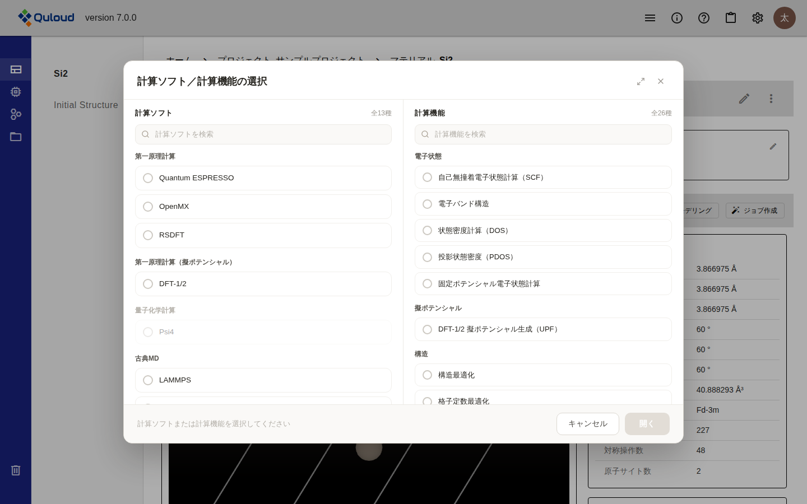
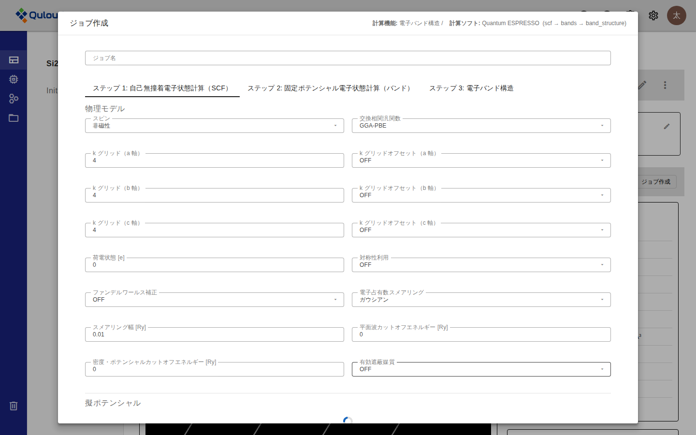
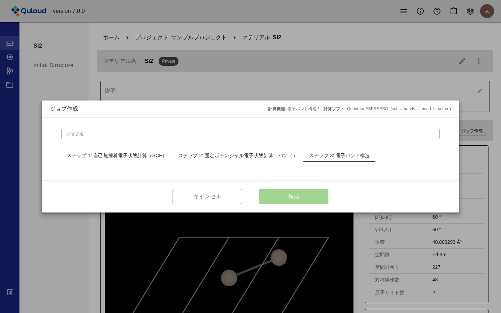
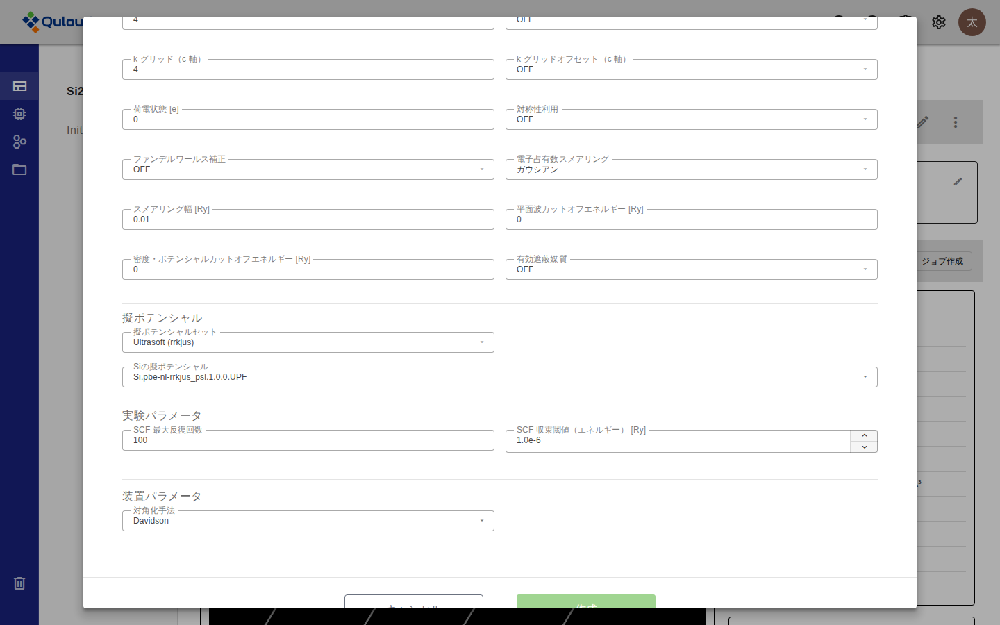

.. _job-section:

==============================
計算 Job の登録
==============================

.. note::

   本章は Quloud Ver.7.0 を対象としています。記載内容の確認日は 2026 年 9 月 8 日です。

|
|

------------------------------
概要
------------------------------

計算 Job は、Material 詳細画面から登録します。手順は 3 段階です。

1.  「計算ソフト」と「計算機能」の組み合わせを選ぶ
2.  ジョブ名と、ステップごとの入力項目を指定する
3.  「作成」で Job を登録する

登録した時点では計算は始まりません。実行は :doc:`runjob` の章で説明します。

.. note::

   Ver.6.1.2 以前は、計算の種類ごとに専用の入力フォームが用意されていました。
   Ver.7.0 では、選んだ計算ソフトと計算機能の組み合わせに応じて入力項目が組み立てられる
   方式に変わっています。Ver.6.1.2 以前に作成した Job の表示については
   :doc:`specifications` の章をご参照ください。

|
|

------------------------------
前提
------------------------------

-   計算対象の Material が登録されていること（:doc:`jobs_and_models_atom` の章）
-   Material が属する Project に参加していること
-   テナントで、使いたい計算ソフトが利用できること（:doc:`introduction` の章）

|
|

------------------------------
操作手順
------------------------------

|

##############################################
1. 計算ソフトと計算機能を選ぶ
##############################################

Material 詳細画面の「Initial Structure」の右にある「ジョブ作成」を押すと、
「計算ソフト／計算機能の選択」ダイアログが開きます。

   「計算ソフト／計算機能の選択」ダイアログ

左が「計算ソフト」、右が「計算機能」です。どちらから選んでもかまいません。
一覧は区分ごとにまとめられており、上部の検索欄で絞り込めます。

**片方を選ぶと、もう片方はその組み合わせが存在するものだけに絞られます。**\
各一覧の右上に、絞り込み後の件数が「〇件が対応」と表示されます。

   計算ソフトと計算機能を選んだ状態

下部に選んだ内容が表示されます。選び直す場合は「クリア」を押します。
「開く」を押すと入力フォームに進みます。

選べる組み合わせの一覧は :doc:`specifications` の章に掲載しています。

.. note::

   選べない組み合わせは灰色で表示されます。**Psi4 は分子専用**\ のため、結晶の Material
   では選択できません。テナントに割り当てられていない計算ソフトも選択できません。

|

##############################################
2. ジョブ名と入力項目を指定する
##############################################

「ジョブ作成」フォームが開きます。上部に、選んだ計算機能・計算ソフトと、実行される
ステップが表示されます。

   「ジョブ作成」フォーム（ステップ 1）

「ジョブ名」は必須です。

**ステップが複数ある計算機能では、ステップごとにタブが分かれます。** 例の
「電子バンド構造」は 3 ステップからなり、それぞれのタブで入力項目を指定します。
入力項目が無いステップもあります。

   入力項目が無いステップ（ステップ 3）

入力項目は、まとまりごとに見出しを付けて表示されます。ダイアログの中をスクロールすると
続きが現れます。

   まとまりごとの見出し（スクロール後）

計算機能によっては、既存の Job の結果や構造を選ぶタブが加わります。

-   **NEB（Nudged Elastic Band）** — 「初期構造選択」「終期構造選択」
-   **交換結合パラメータ（SPRKKR）** — 「SCF結果選択」
-   **モンテカルロ磁性計算（Quloud-Mag）** — 「JXC結果選択」

各項目の意味・既定値・範囲は、この章の「入力項目」節をご参照ください。

|

##############################################
3. Job を登録する
##############################################

「作成」を押すと Job が登録されます。Material 詳細画面の「ジョブ」に、Status が
「Registered」の Job として追加されます。

登録した Job は、実行するまで編集・複製・削除ができます（:doc:`jobdetail` の章）。

|
|

------------------------------
結果
------------------------------

-   Material 詳細画面の「ジョブ」の一覧に、登録した Job が Status「Registered」で現れます
-   この時点では計算は始まっておらず、ポイントも消費されません
-   実行するには「Run Job」が必要です（:doc:`runjob` の章）

|
|

------------------------------
注意事項
------------------------------

-   計算ソフトごとの制限や既知の問題は :doc:`specifications` の章にまとめています。
    Job を登録する前にご確認ください。
-   入力ファイルを直接アップロードして Job を実行する方法については
    :doc:`files` の章をご参照ください。

|
|

------------------------------
入力項目
------------------------------

入力項目は、**計算ソフトと機能の組み合わせごと**\ に決まっています。ステップが複数ある
計算機能では、各ステップのタブに、そのステップの組み合わせの項目が表示されます。

たとえば Quantum ESPRESSO の「電子バンド構造」は、次の 3 つの組み合わせの項目を
順に指定することになります。

-   Quantum ESPRESSO / 自己無撞着電子状態計算（SCF）
-   Quantum ESPRESSO / 固定ポテンシャル電子状態計算（バンド）
-   Quantum ESPRESSO / 電子バンド構造

以下は組み合わせごとの一覧です。列の意味は次のとおりです。

.. list-table::
   :header-rows: 1
   :widths: 20 80

   * - 列
     - 意味
   * - 項目名
     - 画面に表示される項目名です。
   * - キー
     - 内部で使われる識別子です。入力ファイルや出力ファイルの中で使われることがあります。
   * - 型
     - 入力欄の種類です。
   * - 単位
     - 値の単位です。単位が無い項目は ``-`` です。
   * - 既定値
     - 何も変更しなかった場合の値です。
   * - 範囲・制約
     - 入力できる値の範囲と、必須かどうかです。
   * - 選択肢
     - 選択式の項目で選べる値です。
   * - 表示条件
     - ほかの項目の値によって表示・非表示が切り替わる項目の条件です。
       条件が書かれていない項目は常に表示されます。

表は「ジョブ作成」フォームでの並びに合わせて、「物理モデル」「実験パラメータ」
「装置パラメータ」に分けています。フォームでも同じ見出しでまとまって表示されます。

.. note::

   次の入力は、この表には含まれません。項目が固定ではなく、選んだ Material の元素や
   構造から組み立てられるためです。

   -   **擬ポテンシャル** — 「擬ポテンシャルセット」と、元素ごとの擬ポテンシャルファイル
   -   **原子ごとの拘束条件・初期スピン** — Material の原子サイトごとに指定します
   -   **DFT-1/2 の対象元素**、**HybMD の擬ポテンシャル**

.. include:: _generated/params_all.rst
