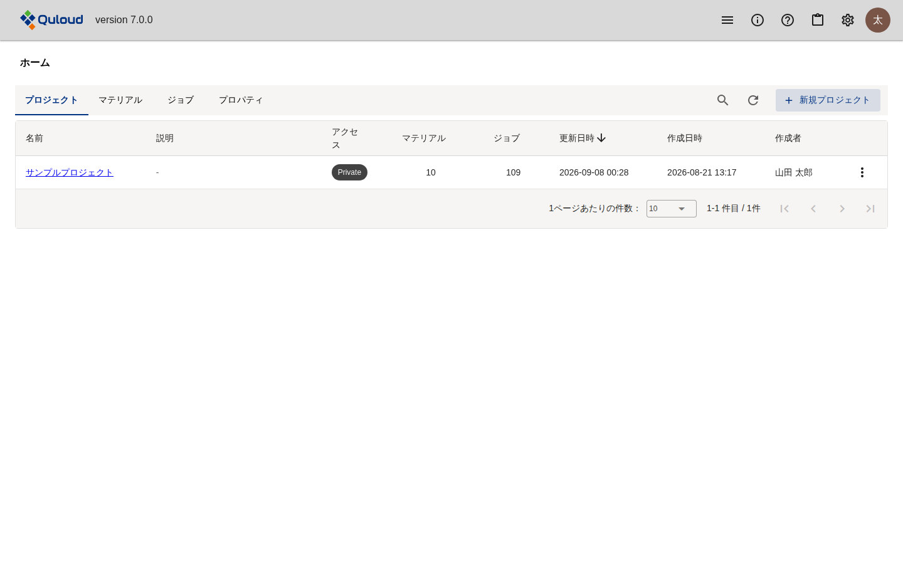
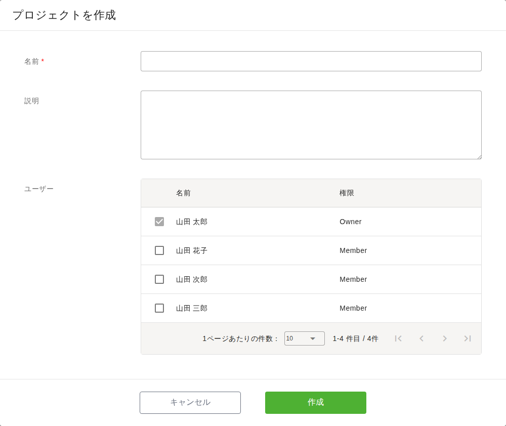
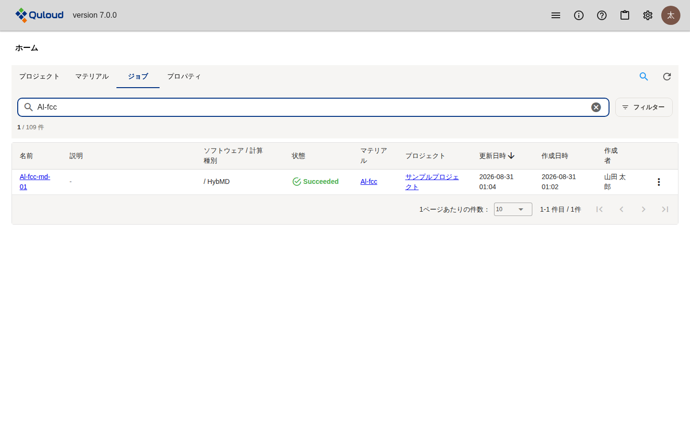
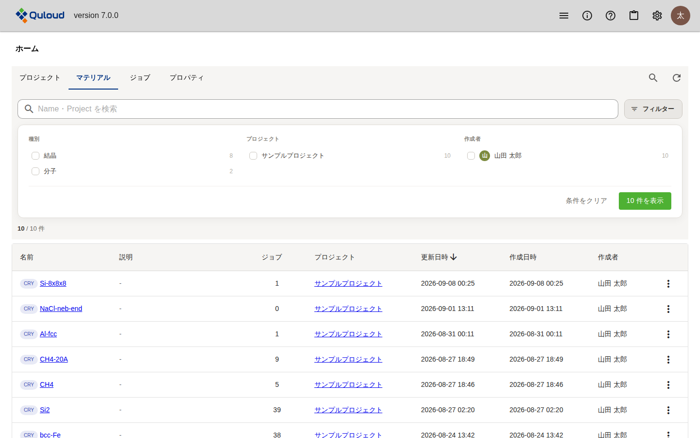

==============================
ホーム画面
==============================

.. note::

   本章は Quloud Ver.7.0 を対象としています。記載内容の確認日は 2026 年 9 月 8 日です。

|
|

------------------------------
概要
------------------------------

サインインすると開く画面です。テナントにあるものを 4 つのタブで一覧します。

.. list-table::
   :header-rows: 1
   :widths: 22 78

   * - タブ
     - 内容
   * - プロジェクト
     - 計算の入れ物です。Material と Job はプロジェクトの中に置かれます。
   * - マテリアル
     - 計算の対象となる原子構造です（:doc:`jobs_and_models_atom` の章）。
   * - ジョブ
     - 計算の実行単位です（:doc:`calculation` ・ :doc:`runjob` の章）。
   * - プロパティ
     - 計算結果を Material にまとめたものです（:doc:`property` の章）。

いずれのタブも同じ作りで、一覧の上に検索と絞り込み、各行の右端に「⋮」の
メニューがあります。

.. note::

   ヘッダーの左端にあるメニューからも、各タブに直接移動できます
   （:doc:`header` の章）。

|
|

------------------------------
プロジェクト
------------------------------

   ホーム画面（プロジェクトのタブ）

「アクセス」は、そのプロジェクトが自分だけのものか（``Private``）、
テナントのメンバーと共有されているか（``Collabo``）を表します。
「マテリアル」「ジョブ」の列はそのプロジェクトに属する件数です。

|

##############################################
プロジェクトを作る
##############################################

右上の「＋ 新規プロジェクト」を押します。

   「プロジェクトを作成」ダイアログ

名前を入れて「作成」を押します。「ユーザー」で選んだ人とプロジェクトを共有できます。
自分は常に含まれます。共有すると、選んだ人のホーム画面にもこのプロジェクトが現れ、
アクセスが ``Collabo`` になります。

|

##############################################
プロジェクトの操作
##############################################

各行の「⋮」から操作します。

.. list-table::
   :header-rows: 1
   :widths: 20 80

   * - 項目
     - 動作
   * - 説明
     - 説明を表示します。
   * - 編集
     - 名前・説明・共有するメンバーを変更します。
   * - 削除
     - プロジェクトを削除します。

**「編集」「削除」が出るのは、自分が作成したプロジェクトか、管理ユーザー（Owner）の
場合だけです。**

名前を押すとプロジェクト詳細画面に移り、そのプロジェクトのマテリアル・ジョブ・
プロパティが並びます（:doc:`jobs_and_models_atom` の章）。

|
|

------------------------------
マテリアル・ジョブ・プロパティ
------------------------------

いずれもテナント全体の一覧です。名前を押すとそれぞれの画面に移ります。

.. list-table::
   :header-rows: 1
   :widths: 22 78

   * - タブ
     - 「⋮」からできること
   * - マテリアル
     - 説明 / 編集 / 他のプロジェクトへ移動 / 削除
   * - ジョブ
     - 実行またはキャンセル / 説明 / 編集 / 削除（:doc:`runjob` の章）
   * - プロパティ
     - 編集（グループ名の変更）/ 削除（:doc:`property` の章）

   ホーム画面（ジョブのタブ、検索で絞り込んだ状態）

|
|

------------------------------
検索と絞り込み
------------------------------

タブの右にある虫眼鏡を押すと、検索欄と「フィルター」が現れます。

   フィルターのパネル（マテリアルのタブ）

-   **検索欄**\ は名前などの部分一致です。欄の下に「絞り込み後の件数 / 全体の件数」が
    表示されます
-   **フィルター**\ は、まとまりごとにチェックを入れて絞り込みます。各項目の右の数字は
    その条件に当てはまる件数です
-   条件はまとまりの中では「いずれか」、まとまりの間では「すべて」で組み合わされます
-   「条件をクリア」でフィルターを外します

絞り込める項目はタブによって異なります。

.. list-table::
   :header-rows: 1
   :widths: 22 78

   * - タブ
     - 絞り込める項目
   * - プロジェクト
     - アクセス、作成者
   * - マテリアル
     - 種別（結晶・分子）、プロジェクト、作成者
   * - ジョブ
     - 状態、ソフトウェア、ソフトウェア / 計算種別、作成者
   * - プロパティ
     - プロジェクト、作成者

プロジェクト詳細画面のように 1 つのプロジェクトに絞られている画面では、
「プロジェクト」のまとまりは表示されません。

.. note::

   プロジェクト詳細画面の各一覧にも、同じ検索と絞り込みがあります。

|
|

------------------------------
注意事項
------------------------------

-   **一覧は自動では更新されません。** Job の状態などを見直すには、
    タブの右にある更新アイコンを押すか、画面を再読み込みしてください。
-   テナントが利用制限中の場合は画面上部に警告が表示され、プロジェクト・
    マテリアル・ジョブの作成ができなくなります（:doc:`runjob` の章）。
