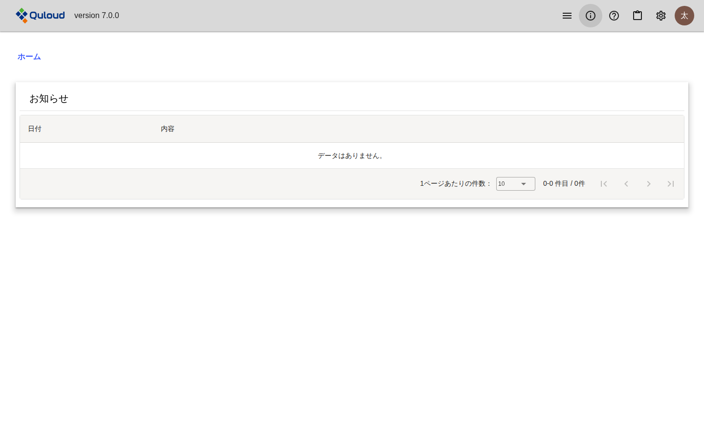
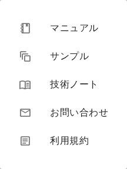
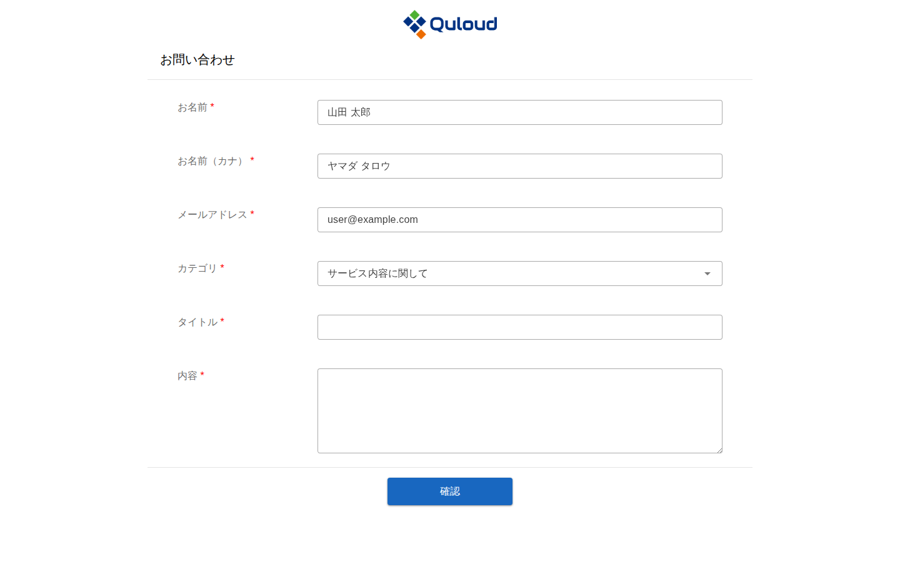
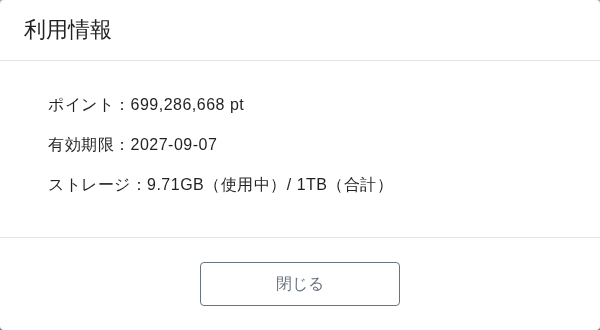
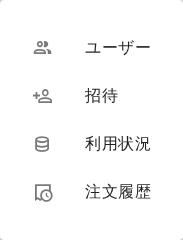
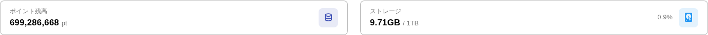
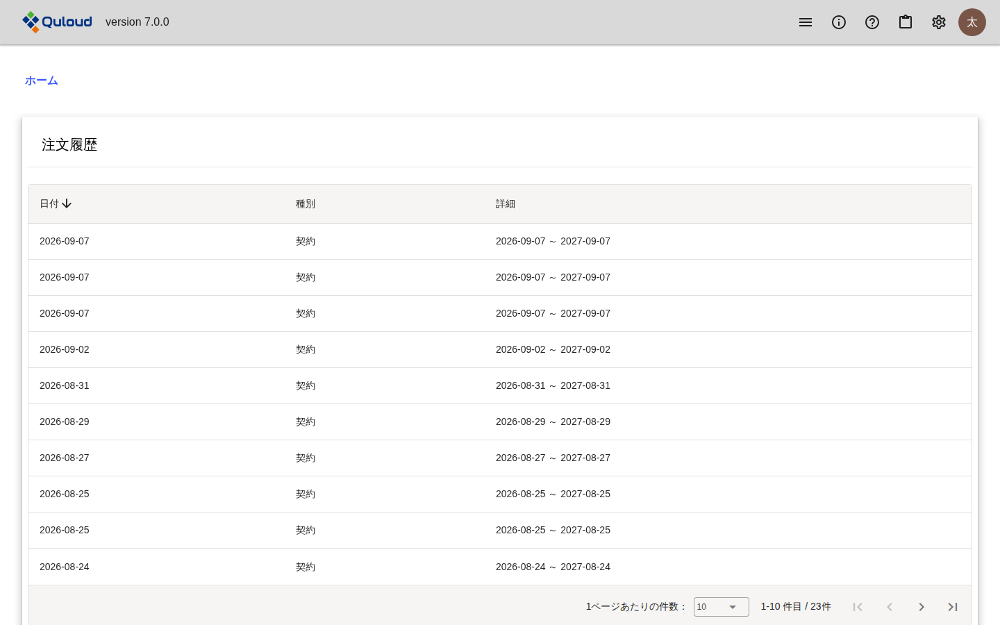
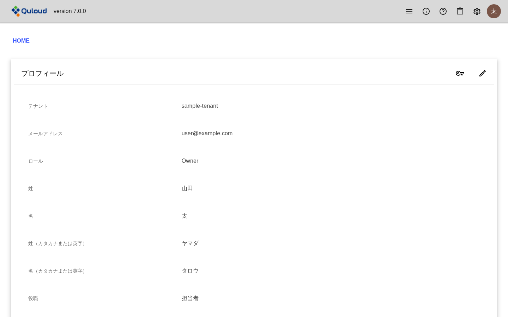

========================================
ヘッダーメニュー
========================================

.. note::

   本章は Quloud Ver.7.0 を対象としています。記載内容の確認日は 2026 年 9 月 8 日です。

|
|

------------------------------
概要
------------------------------

画面の上端は全画面で共通です。左端のロゴを押すとホーム画面に戻ります。
右端には 6 つのアイコンが並びます。

   ヘッダー

.. list-table::
   :header-rows: 1
   :widths: 20 20 60

   * - アイコン
     - 名前
     - 内容
   * - 横三本線
     - メニュー
     - ホーム画面の各タブへ直接移動します。
   * - 丸に ``i``
     - お知らせ
     - 運営からのお知らせを表示します。未読があるとバッジが付きます。
   * - 丸に ``?``
     - ヘルプ
     - マニュアル・サンプル・技術ノート・お問い合わせ・利用規約
   * - ボード
     - 利用情報
     - ポイント残高・有効期限・ストレージ使用量
   * - 歯車
     - 設定
     - ユーザー・招待・利用状況・注文履歴
   * - アバター
     - アカウント
     - プロフィール・サインアウト

|
|

------------------------------
メニュー
------------------------------

横三本線のアイコンから、ホーム画面の「プロジェクト」「マテリアル」「ジョブ」
「プロパティ」の各タブへ直接移動できます（:doc:`dashboard` の章）。

|
|

------------------------------
お知らせ
------------------------------

丸に ``i`` のアイコンを押すと、運営からのお知らせの一覧が開きます。
未読のお知らせがあると、アイコンに件数のバッジが付きます。

   お知らせ

重要なお知らせは、ホーム画面を開いたときにダイアログでも表示されます。

|
|

------------------------------
ヘルプ
------------------------------

丸に ``?`` のアイコンを押すと、次の項目が並びます。

   ヘルプのメニュー

.. list-table::
   :header-rows: 1
   :widths: 24 76

   * - 項目
     - 内容
   * - マニュアル
     - 本書を別のタブで開きます。
   * - サンプル
     - 計算例を集めたサイトを別のタブで開きます。
   * - 技術ノート
     - 技術的な解説を集めたサイトを別のタブで開きます。
   * - お問い合わせ
     - 問い合わせフォームを別のタブで開きます。
   * - 利用規約
     - 利用規約の PDF を別のタブで開きます。

|

##############################################
お問い合わせ
##############################################

   お問い合わせフォーム

お名前・メールアドレスにはサインイン中のユーザーの情報が入ります。
カテゴリを選び、タイトルと内容を入力して「確認」を押します。
確認画面で内容を見直してから送信します。送信すると、入力した内容が
メールでも届きます。

|
|

------------------------------
利用情報
------------------------------

ボードのアイコンを押すと、テナントの利用状況の要約が表示されます。

   「利用情報」ダイアログ

-   **ポイント** — テナントに残っているポイントです。0 以下になると赤く表示され、
    Job を実行できなくなります（:doc:`runjob` の章）
-   **有効期限** — 契約の終了日です
-   **ストレージ** — 使用中の容量と上限です

|
|

------------------------------
設定
------------------------------

歯車のアイコンを押すと、テナントの管理に関する項目が並びます。

   設定のメニュー

.. list-table::
   :header-rows: 1
   :widths: 24 76

   * - 項目
     - 内容
   * - ユーザー
     - テナントに所属するユーザーの一覧です（:doc:`invitation` の章）。
   * - 招待
     - 新しいユーザーを招待します（:doc:`invitation` の章）。
   * - 利用状況
     - ポイントとストレージの使用状況です。
   * - 注文履歴
     - 契約とポイント購入の履歴です。**管理ユーザー（Owner）にだけ表示されます。**

|

##############################################
利用状況
##############################################

   利用状況（ポイント残高とストレージ）

上部にポイント残高とストレージの使用量が並び、その下が「ポイント」と
「ストレージ」の 2 つのタブに分かれます。

**ポイントのタブ**\ には、ポイントの増減の履歴が日時の新しい順に並びます。
「ユーザー」と「種別」で絞り込めます。

.. list-table::
   :header-rows: 1
   :widths: 24 76

   * - 種別
     - 内容
   * - 契約付与
     - 契約により付与されたポイントです。
   * - 購入
     - 追加で購入したポイントです。
   * - 繰越
     - 前の契約期間から繰り越されたポイントです。
   * - 補填・手動調整
     - 運営による調整です。
   * - ジョブ使用
     - Job の実行で消費したポイントです。ジョブ名から Job に移動できます。
   * - 失効
     - 有効期限を過ぎて失効したポイントです。
   * - トライアル終了
     - トライアル終了に伴う調整です。

**ストレージのタブ**\ には、Material・Job ごとの使用容量と最終利用日時が並びます。

|

##############################################
注文履歴
##############################################

   注文履歴

契約とポイント購入の履歴です。管理ユーザー（Owner）にだけ表示されます。

|
|

------------------------------
アカウント
------------------------------

右端のアバターを押すと、「プロフィール」と「サインアウト」が並びます。
サインアウトについては :doc:`signin` の章をご参照ください。

|

##############################################
プロフィール
##############################################

   プロフィール

サインイン中のユーザーの情報です。右上のアイコンから変更できます。

.. list-table::
   :header-rows: 1
   :widths: 20 80

   * - アイコン
     - 動作
   * - 鉛筆
     - 姓・名・カナ・役職・表示言語を変更します。
   * - 鍵
     - パスワードを変更します。

**テナント・メールアドレス・ロールは変更できません。** 変更が必要な場合は
管理ユーザー（Owner）または運営にお問い合わせください。

表示言語は「日本語」と「英語」から選べます。

|
|

------------------------------
注意事項
------------------------------

-   「注文履歴」は管理ユーザー（Owner）にだけ表示されます。メンバーの画面には
    項目自体が現れません。
-   ポイント残高が 0 以下、ストレージが上限超過、契約期間外のいずれかに
    当てはまると、画面上部に警告が表示され、プロジェクト・マテリアル・ジョブの
    作成と実行ができなくなります（:doc:`runjob` の章）。
