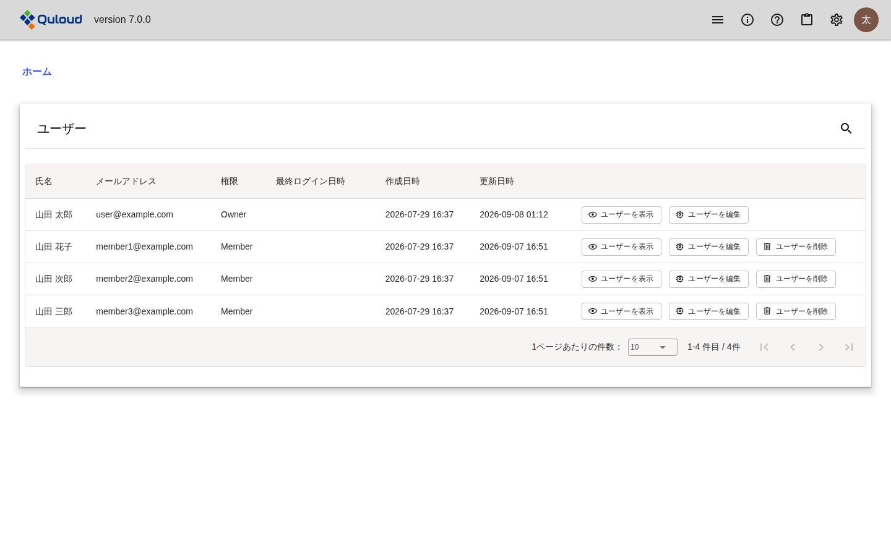
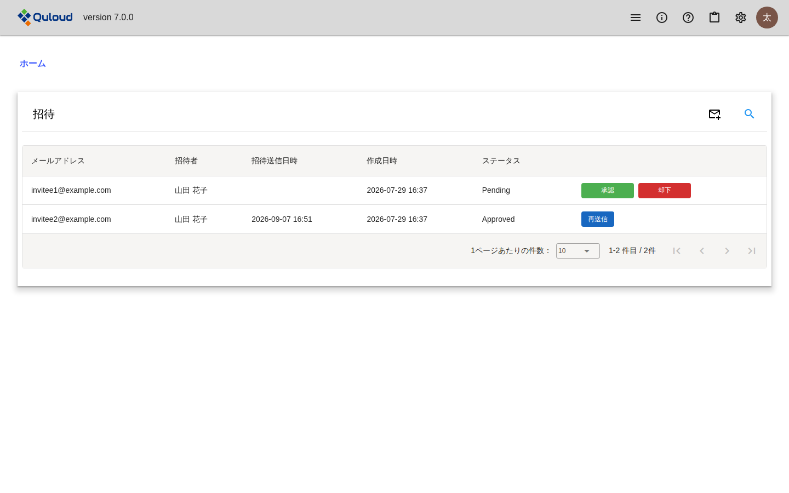
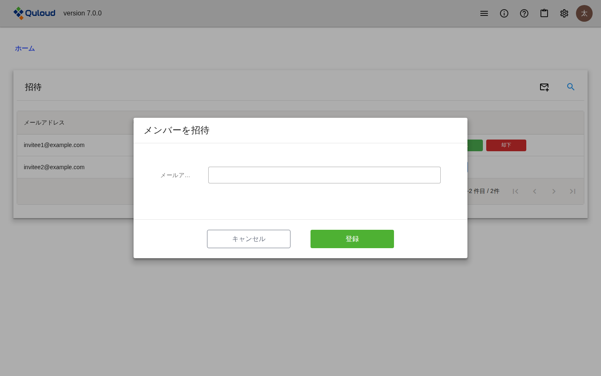

========================================
新規ユーザーの招待
========================================

.. note::

   本章は Quloud Ver.7.0 を対象としています。記載内容の確認日は 2026 年 9 月 8 日です。

すべてのユーザーはいずれかのテナントに所属します。管理ユーザー（Owner）は、新規ユーザーを
自分が所属するテナントに招待して、モデリングや材料シミュレーションを共同で行ったり、
結果を共有したりすることができます。テナントとロールについては :doc:`introduction` の章の
「用語」をご参照ください。

|
|

----------------------------------------
テナントのユーザーを確認する
----------------------------------------

ヘッダーの歯車のアイコン（「設定」）を押し、「ユーザー」を選びます。

   ユーザー一覧

テナントに所属するユーザーが一覧で表示されます。「権限」の列には「Owner」または
「Member」が表示されます。

各行のボタンでできることは次のとおりです。「ユーザーを編集」と「ユーザーを削除」は
管理ユーザーにのみ表示されます。

.. list-table::
   :header-rows: 1
   :widths: 26 74

   * - ボタン
     - できること
   * - ユーザーを表示
     - 氏名・カナ・メールアドレス・権限を確認します。
   * - ユーザーを編集
     - 権限（Owner / Member）を変更します。
   * - ユーザーを削除
     - ユーザーを削除します。自分自身と、権限が Owner のユーザーは削除できません。

利用申込（:doc:`signup` の章）とサインイン（:doc:`signin` の章）を終えた直後は、
テナントのユーザーは本人のみです。ここに新規ユーザーを追加する方法を以下で説明します。

|
|

----------------------------------------
新規ユーザーを招待する
----------------------------------------

ヘッダーの歯車のアイコン（「設定」）を押し、「招待」を選びます。

   招待一覧

招待の一覧が表示されます。右上の封筒のアイコンから新しい招待を登録し、各行のボタンで
招待を進めます。これらの操作は管理ユーザーにのみ表示されます。

|

################################################
招待するメールアドレスを登録する
################################################

一覧の右上にある封筒のアイコンを押すと、「メンバーを招待」ダイアログが開きます。

   「メンバーを招待」ダイアログ

招待したいユーザーのメールアドレスを入力して「登録」ボタンを押すと、招待が一覧に
追加されます。このときのステータスは「Pending」で、**招待メールはまだ送信されません。**

|

################################################
招待メールを送信する
################################################

ステータスが「Pending」の招待には「承認」と「却下」のボタンが表示されます。

-   「承認」を押すと、登録したメールアドレスに招待メールが送信され、ステータスが
    「Approved」になります。
-   「却下」を押すと、その招待は削除されます。削除できるのはステータスが「Pending」の
    ときだけです。

ステータスが「Approved」の招待には「再送信」ボタンが表示されます。押すと招待メールが
もう一度送信されます。

.. note::

   **「再送信」を行うと、以前の招待メールに記載された URL は使えなくなります。**
   再送信のたびに新しい URL が発行されるためです。

|

################################################
一覧に表示される招待
################################################

招待一覧は、初期状態ではステータスが「Pending」と「Approved」の招待だけを表示します。
登録が完了した招待（ステータス「Invited」）は表示されません。右上の虫めがねのアイコンから
検索条件のステータスを変更すると表示できます。

|
|

-----------------------------------------------------------
招待された新規ユーザーの登録
-----------------------------------------------------------

ここからは、招待メールを受信したユーザー側の手順です。

招待メールに記載された URL を開くと、登録画面が表示されます。画面には招待元のテナント名と
招待されたメールアドレスが表示され、次の項目を入力します。

-   姓、名（必須）
-   姓カナ、名カナ（必須。カタカナまたは英字）
-   新しいパスワード、新しいパスワード（確認）（必須）

「登録」ボタンを押すと、:doc:`signin` の章で説明したサインイン画面に移ります。
登録したメールアドレスと、いま設定したパスワードでサインインしてください。

.. note::

   **招待メールの URL は、メールが送信されてから 7 日間だけ有効です。** 期限を過ぎた
   場合は、テナントの管理ユーザーに「再送信」を依頼してください。

登録が完了すると、招待のステータスは「Invited」になり、ユーザー一覧に新しいユーザーが
追加されます。権限は「Member」です。管理ユーザーは、必要に応じてユーザー一覧の
「ユーザーを編集」から権限を「Owner」に変更できます。
