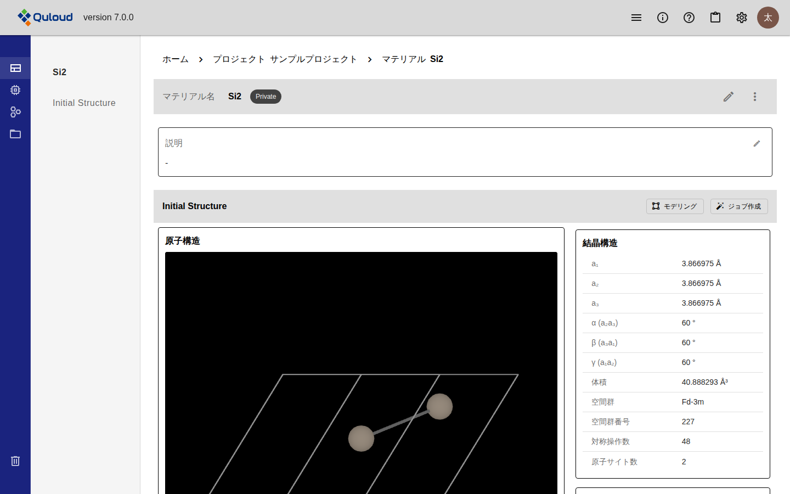
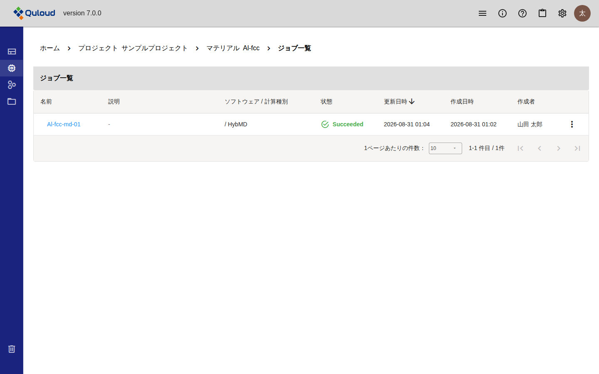
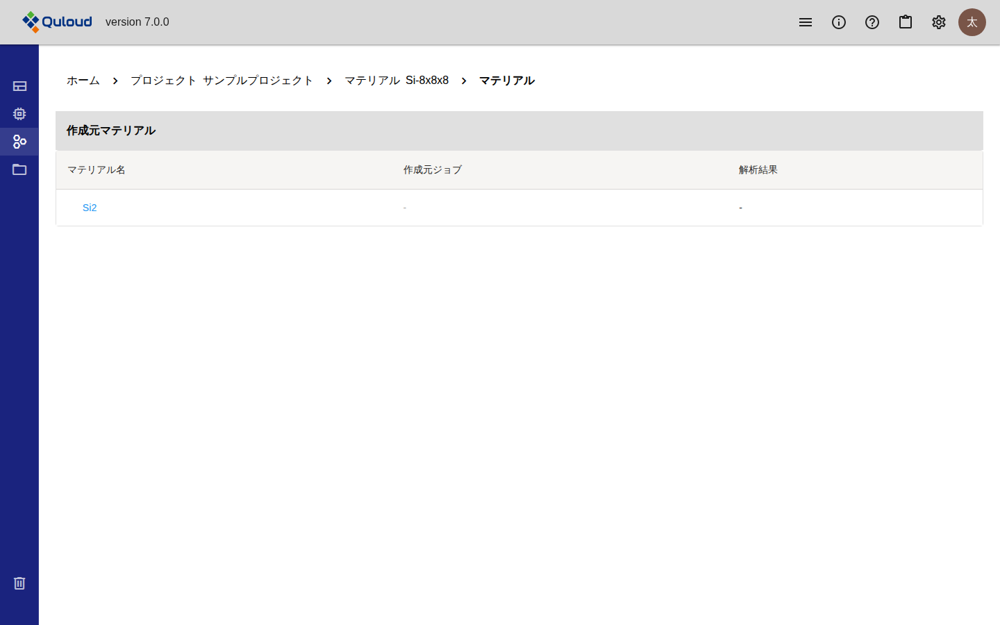
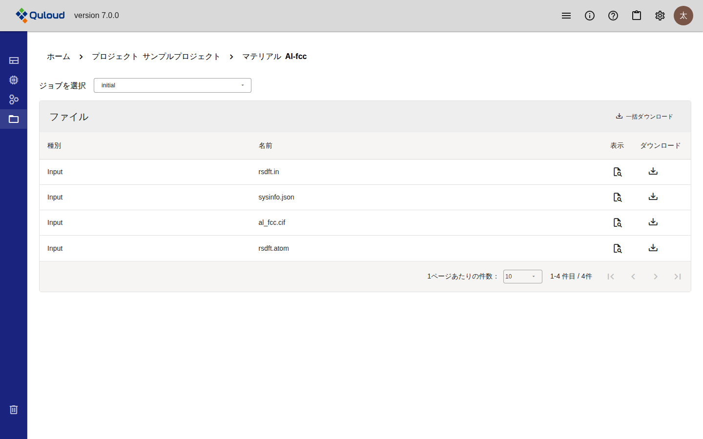

.. _jobdetail-section:

==============================
Material 詳細画面
==============================

.. note::

   本章は Quloud Ver.7.0 を対象としています。記載内容の確認日は 2026 年 9 月 8 日です。

|
|

------------------------------
概要
------------------------------

Material 詳細画面は、1 つの Material に関わるものをすべてまとめた画面です。
プロジェクトのマテリアル一覧、またはホーム画面の「マテリアル」タブから
名前を押すと開きます。

画面は左のメニューで 4 つに切り替わります。

   左のメニュー（ホバーで展開した状態）

.. list-table::
   :header-rows: 1
   :widths: 22 78

   * - メニュー
     - 内容
   * - プロパティ
     - 初期構造と、登録した Property が並びます。既定で開くペインです。
   * - ジョブ
     - この Material から作られた Job の一覧と、Job の詳細です。
   * - マテリアル
     - この Material の作成元と、この Material から作られた Material です。
   * - ファイル
     - 入出力ファイルの一覧です。
   * - 削除
     - Material を削除します。

.. note::

   左のメニューはアイコンだけの状態で表示されており、**マウスを乗せると項目名が
   現れます。**

|
|

------------------------------
プロパティ
------------------------------

既定で開くペインです。Material の名前・説明と、初期構造が並びます。

   プロパティのペイン

|

##############################################
名前と説明を変える
##############################################

「マテリアル名」の行と「説明」の枠にある鉛筆のアイコンを押すと、その場で編集できます。
Enter で確定、Esc で取り消しです。

|

##############################################
初期構造を見る
##############################################

「Initial Structure」には、登録した原子構造が 3D で表示されます。

-   ドラッグで向きを変えられます。マウスホイールで拡大・縮小できます
-   右上の拡大アイコンで画面いっぱいに表示できます
-   右側には構造から計算された情報が並びます。結晶では「結晶構造」（格子定数・
    空間群など）、分子では「分子構造」が表示され、いずれにも「化学構造」と
    「原子情報」が付きます

見出しの右にある 2 つのボタンから、次の操作に進みます。

-   **モデリング** — 構造を加工して別の Material を作ります（:doc:`modeling` の章）
-   **ジョブ作成** — この構造で計算 Job を登録します（:doc:`calculation` の章）

|

##############################################
登録した Property
##############################################

初期構造の下に、Property として登録した結果がグループごとに並びます。
登録の方法と操作は :doc:`property` の章で説明します。

|
|

------------------------------
ジョブ
------------------------------

この Material から作られた Job の一覧です。

   ジョブのペイン（ジョブ一覧）

名前を押すと、その Job の詳細に移ります。詳細画面の中身は次の章で説明します。

.. list-table::
   :header-rows: 1
   :widths: 24 76

   * - 節
     - 説明している章
   * - ジョブ概要・計算リソース
     - :doc:`runjob` の章
   * - Results
     - :doc:`visualization` の章
   * - 入力
     - :doc:`calculation` の章
   * - ログ・ファイル
     - :doc:`files` の章

各行の右端の「⋮」から、その Job に対する操作ができます。

.. list-table::
   :header-rows: 1
   :widths: 20 80

   * - 項目
     - 動作
   * - 実行
     - Status が「Registered」の Job にだけ出ます（:doc:`runjob` の章）。
   * - キャンセル
     - Status が「Submitted」「Prepared」「Running」の Job にだけ出ます。
   * - 説明
     - Job の説明を編集します。
   * - 編集
     - ジョブ名を編集します。
   * - 削除
     - Job を削除します。

.. note::

   Ver.6.1.2 以前に作成した Job と、Ver.7.0 で作成した Job とでは、Job 詳細画面の
   「入力」の表示が異なります。詳しくは :doc:`specifications` の章をご参照ください。

|
|

------------------------------
マテリアル
------------------------------

この Material が何から作られたか、この Material から何が作られたかを表示します。

   マテリアルのペイン（作成元マテリアル）

.. list-table::
   :header-rows: 1
   :widths: 28 72

   * - 節
     - 内容
   * - 作成元マテリアル
     - この Material のもとになった Material です。モデリングで作った場合は
       もとの Material が、計算結果から保存した場合はその Job と結果も並びます。
   * - 派生マテリアル
     - この Material から作られた Material です。

該当するものが無い節は表示されません。

|
|

------------------------------
ファイル
------------------------------

Material と Job の入出力ファイルの一覧です。

   ファイルのペイン

-   上部の「ジョブを選択」で、Material 自身（``initial``）とこの Material の
    Job を切り替えます
-   Job を選ぶと「入力ファイル」「出力ファイル」の切り替えが現れます
-   「表示」でファイルの中身を確認できます。「ダウンロード」で 1 件ずつ、
    「一括ダウンロード」で ZIP にまとめて取得できます

ファイルの中身については :doc:`files` の章で説明します。

.. note::

   **ファイルを編集できるのは、Status が「Registered」の Job の入力ファイルだけです。**
   Material 自身のファイルは Ver.7.0 では編集できません（閲覧のみ）。
   実行前の Job の入力ファイルを直接書き換えれば、画面に用意されていない
   細かい設定でも計算できます。

|
|

------------------------------
Material の移動と削除
------------------------------

|

##############################################
他のプロジェクトへ移動する
##############################################

「マテリアル名」の行の右端にある「⋮」から「他のプロジェクトへ移動」を選び、
移動先のプロジェクトを指定します。**その Material を使っている Job も一緒に
移動します。**

|

##############################################
削除する
##############################################

左のメニューのいちばん下にある「削除」、または「マテリアル名」の行の「⋮」から
「削除」を選びます。

.. warning::

   **Material を削除すると、その Material を使っている Job もすべて削除されます。**
   削除ダイアログに対象の Job が一覧されるので、確認のチェックを入れてから
   「削除」を押します。

参加していないプロジェクトの Job がその Material を使っている場合は削除できません。
そのプロジェクトのメンバーに依頼してください。
