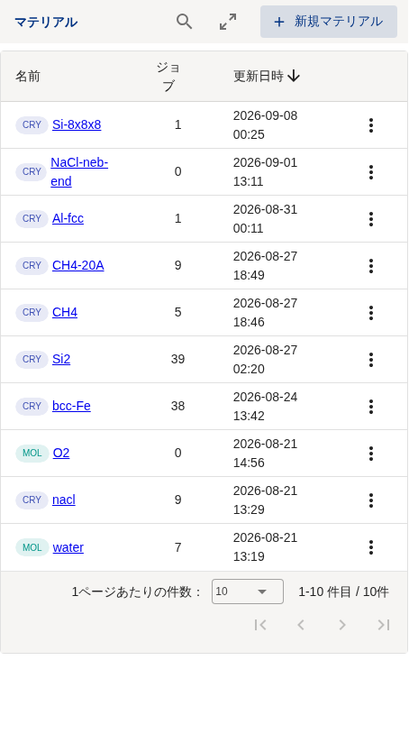
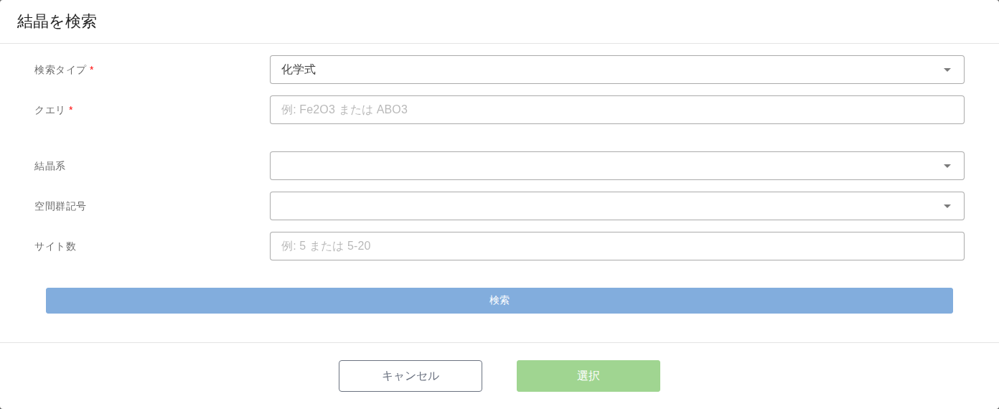
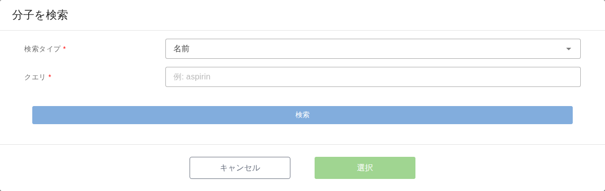
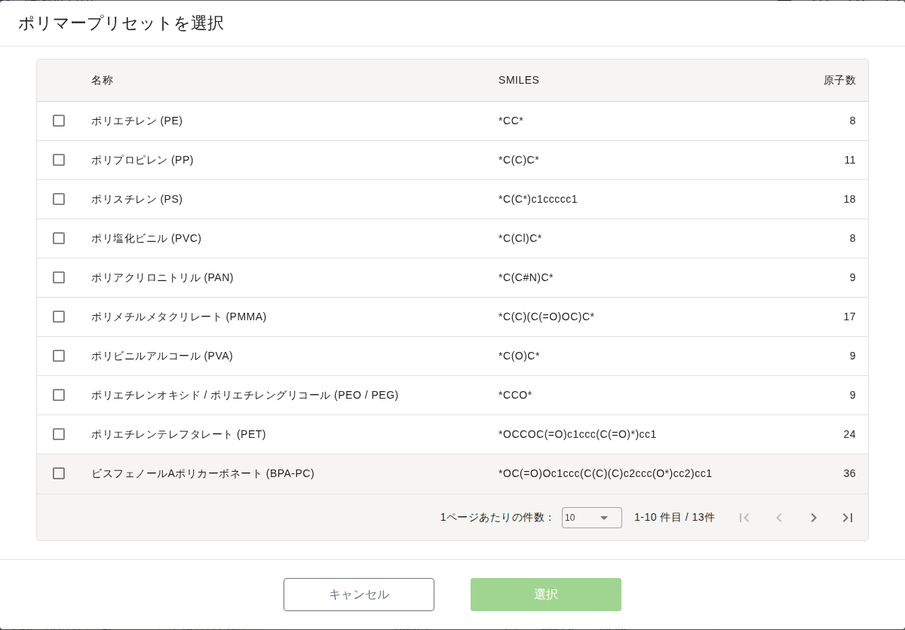

.. _material-create:

==============================
Material の登録
==============================

.. note::

   本章は Quloud Ver.7.0 を対象としています。記載内容の確認日は 2026 年 9 月 8 日です。

|
|

------------------------------
概要
------------------------------

Material は計算の対象となる原子構造です。原子構造の指定には 3 つの方法があります。

1.  **結晶データベースから選ぶ** — Materials Project を検索します
2.  **分子データベースから選ぶ** — PubChem を検索するか、ポリマープリセットから選びます
3.  **ファイルをアップロードする** — 手元の構造ファイルを読み込みます

登録した Material をモデラーで加工して別の Material にすることもできます
（:doc:`modeling` の章）。

|
|

------------------------------
前提
------------------------------

-   登録先のプロジェクトに参加していること
-   テナントが利用制限中でないこと（:doc:`runjob` の章）

|
|

------------------------------
操作手順
------------------------------

|

##############################################
1. 「新規マテリアル」を押す
##############################################

Material はプロジェクトごとに登録します。ホーム画面の「プロジェクト」から
プロジェクトを開き、「マテリアル」の右上にある「＋ 新規マテリアル」を押します。

   プロジェクト詳細画面のマテリアル一覧

一覧の名前の左にあるラベルは構造の種類です。``CRY`` が結晶、``MOL`` が分子です。

|

##############################################
2. 名前と原子構造を指定する
##############################################

「マテリアルを作成」ダイアログが開きます。

   「マテリアルを作成」ダイアログ

.. list-table::
   :header-rows: 1
   :widths: 20 80

   * - 項目
     - 内容
   * - 名前
     - 必須です。一覧に表示される名前です。
   * - 説明
     - 任意です。Material 詳細画面に表示されます。
   * - ソフトウェア
     - 既定は「なし」です。「なし」以外を選ぶと、**Material と同時に計算 Job も
       作られます**\ （この章の「入力ファイルから Job ごと作る」）。
   * - 原子構造
     - 3 つのボタンのどれかで指定します。指定するとダイアログの下に
       選んだ構造やファイルの名前が並びます。

**原子構造を 1 つ以上指定するまで「作成」は押せません。**

|

##############################################
3. 「作成」を押す
##############################################

Material が登録され、プロジェクトのマテリアル一覧に追加されます。
一覧の名前を押すと Material 詳細画面に移ります（:doc:`jobdetail` の章）。

|
|

------------------------------
結晶データベースから登録する
------------------------------

「Crystal DBで検索」を押すと、Materials Project の検索ダイアログが開きます。

   「結晶を検索」ダイアログ

「検索タイプ」で検索の仕方を選び、「クエリ」に検索語を入れて「検索」を押します。

.. list-table::
   :header-rows: 1
   :widths: 22 78

   * - 検索タイプ
     - クエリに入れるもの
   * - マテリアルID
     - Materials Project の ID（``mp-149`` など）
   * - 化学式
     - 化学式（``Fe2O3``、``ABO3`` など）
   * - 元素系
     - 元素の組み合わせ（``Li-Fe-O`` など）
   * - 元素
     - 含まれる元素

「結晶系」「空間群記号」「サイト数」は任意の絞り込みです。サイト数は ``5`` のような
値のほか ``5-20`` の範囲でも指定できます。

検索結果の表から 1 件を選び、「選択」を押すと「マテリアルを作成」ダイアログに戻ります。
表の「マテリアルID」は Materials Project のページへのリンクです。

|
|

------------------------------
分子データベースから登録する
------------------------------

「Molecule DBで検索」を押すと、次の 2 つから選ぶメニューが開きます。

.. list-table::
   :header-rows: 1
   :widths: 30 70

   * - 項目
     - 内容
   * - PubChemで検索
     - PubChem を検索して分子構造を取り込みます。
   * - ポリマープリセットから選択
     - あらかじめ用意されたポリマーの繰り返し単位から選びます。

|

##############################################
PubChem で検索する
##############################################

   「分子を検索」ダイアログ

検索タイプは「名前」「化学式」「CID」「SMILES」「InChI」「InChIKey」から選べます。
入力例はクエリ欄に表示されます。

.. note::

   3D 構造データを持たない分子は登録できません。検索結果に
   「3D構造データがありません」と表示されます。

|

##############################################
ポリマープリセットから選ぶ
##############################################

   「ポリマープリセットを選択」ダイアログ

繰り返し単位の SMILES と原子数が一覧されます。1 件を選んで「選択」を押します。
高分子の計算（RadonPy）で使います。

|
|

------------------------------
ファイルから登録する
------------------------------

「ファイルアップロード」を押すと、ファイルを受け取るダイアログが開きます。

   「ファイルをアップロード」ダイアログ

領域にファイルをドラッグ＆ドロップするか、領域を押してファイルを選び、
「アップロード」を押します。複数のファイルをまとめて指定できます。

読み込める構造ファイルの形式は次のとおりです。

.. list-table::
   :header-rows: 1
   :widths: 30 70

   * - 形式
     - ファイル
   * - CIF
     - ``.cif``
   * - XYZ
     - ``.xyz``
   * - VASP
     - ``.vasp``、``POSCAR``、``CONTCAR``
   * - XSF
     - ``.xsf``
   * - LAMMPS
     - ``.lmp``、``.data``
   * - 計算ソフトの入力ファイル
     - Quantum ESPRESSO、OpenMX、RSDFT の入力ファイル

上記以外でも、構造として解釈できる形式であれば読み込めることがあります。
解釈できない場合は登録時にエラーになります。

|

##############################################
入力ファイルから Job ごと作る
##############################################

「ソフトウェア」で「なし」以外を選ぶと、**アップロードした入力ファイルをそのまま使う
計算 Job が、Material と同時に作られます。** 計算条件を画面で組み立てるのではなく、
手元で用意した入力ファイルで計算したい場合に使います。

選べるソフトウェアは次のとおりです。

.. list-table::
   :header-rows: 1
   :widths: 40 60

   * - ソフトウェア
     - 主な入力ファイル
   * - FLARE
     - ``QuloudJob.yaml``、``rsdft.atom``
   * - LAMMPS / LAMMPS+CHGNet
     - ``in.QuloudJob``、``QuloudJob.lmp``
   * - OpenMX
     - ``openmx.in``
   * - Quantum ESPRESSO (PW)
     - ``QuloudJob.scf.in``
   * - Quantum ESPRESSO (DOS)
     - ``QuloudJob.scf.in``、``QuloudJob.nscf.in``、``QuloudJob.dos.in``
   * - Quantum ESPRESSO (BAND)
     - ``QuloudJob.scf.in``、``QuloudJob.nscf.in``、``QuloudJob.bands.in``
   * - Quantum ESPRESSO (BAND with spin)
     - 上記に ``QuloudJob.bands2.in`` を加えたもの
   * - RSDFT
     - ``rsdft.in``、``rsdft.atom``

**ファイル名は決まっています。** 「作成」を押した時点で内容が検査され、
必要なファイルが足りない場合や中身が想定と違う場合はエラーが表示されます。
擬ポテンシャルファイル（``.upf`` など）も一緒にアップロードできます。

作られた Job は Status が「Registered」なので、実行は :doc:`runjob` の章の手順で行います。

|
|

------------------------------
注意事項
------------------------------

-   **同じ Material を複数のプロジェクトから使うことはできません。** Material は
    1 つのプロジェクトに属します。別のプロジェクトで使いたい場合は、Material 詳細画面の
    「他のプロジェクトへ移動」で移します（:doc:`jobdetail` の章）。
-   Material の削除は、その Material を使っている Job がある場合に制限されます
    （:doc:`jobdetail` の章）。
-   外部データベースの検索は、Materials Project と PubChem に問い合わせます。
    応答が無い場合は時間をおいてやり直してください。
