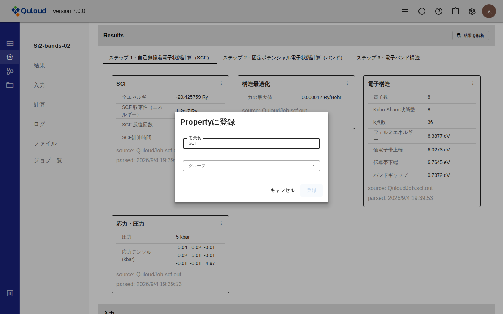
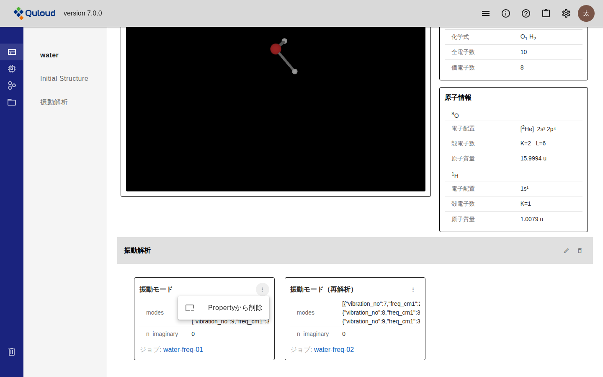
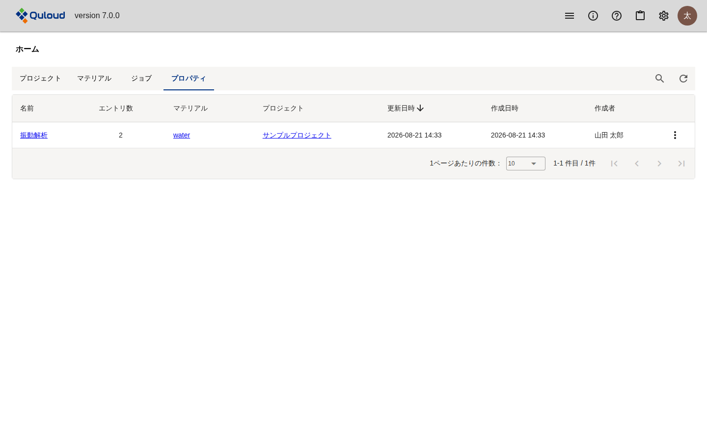

.. _property-section:

==============================
Property
==============================

.. note::

   本章は Quloud Ver.7.0 を対象としています。記載内容の確認日は 2026 年 9 月 8 日です。

|
|

------------------------------
概要
------------------------------

Property は、**計算結果のカードを Material に貼り付けたもの**\ です。
Job をまたいだ結果を 1 つの Material の画面に並べて比べられます。

-   結果のカードは、それを出した Job の詳細画面にしかありません（:doc:`visualization` の章）
-   Property に登録すると、Material 詳細画面の「プロパティ」に並びます
-   Property は**グループ**にまとめます。グループが画面上の見出しになります

.. note::

   Ver.6.1.2 では、Succeeded で終わった Job が自動的にその Material の Property になり、
   「Select Property」で切り替えて見る形でした。Ver.7.0 では自動登録はありません。
   **見たい結果を選んで登録します。**

|
|

------------------------------
前提
------------------------------

-   登録したい結果のカードが Job 詳細画面の「Results」にあること
    （:doc:`visualization` の章）

|
|

------------------------------
操作手順
------------------------------

|

##############################################
1. 結果のカードから登録する
##############################################

Job 詳細画面の「Results」で、登録したいカードの右上にある「⋮」から
「Propertyに登録」を選びます。

   「Propertyに登録」ダイアログ

.. list-table::
   :header-rows: 1
   :widths: 22 78

   * - 項目
     - 内容
   * - 表示名
     - Material の画面に出す名前です。カードの名前が初期値として入ります。
       同じ計算を条件違いで並べるときは、ここで区別が付く名前にします。
   * - グループ
     - 登録先のグループです。既存のグループを選ぶか、
       「＋ 新規グループを作成」を選んで名前を入力します。

**グループの指定は必須です。** どちらも指定するまで「登録」は押せません。

|

##############################################
2. Material 詳細画面で確認する
##############################################

Material 詳細画面の「プロパティ」（左のメニューの一番上）を開くと、初期構造の下に
グループごとの見出しとカードが並びます。

   Material 詳細画面のプロパティ

-   グループの見出しは、左のメニューにも並びます。押すとその位置まで移動します
-   各カードの下には、結果を出した Job へのリンクがあります
-   結果のカードと同じ見た目で表示されます。バンド図や状態密度の図もそのまま並びます

|
|

------------------------------
グループの操作
------------------------------

グループの見出しの右にあるアイコンで、名前の変更と削除ができます。

.. list-table::
   :header-rows: 1
   :widths: 22 78

   * - アイコン
     - 動作
   * - 鉛筆
     - グループ名をその場で編集します。Enter で確定、Esc で取り消しです。
   * - ごみ箱
     - グループを削除します。確認のダイアログが出ます。

.. warning::

   **グループを削除すると、その中の Property もすべて削除されます。**
   計算結果そのもの（Job 詳細画面の「Results」のカード）は残ります。

|
|

------------------------------
Property カードの操作
------------------------------

各カードの右上の「⋮」からメニューが開きます。

   Property カードのメニュー

.. list-table::
   :header-rows: 1
   :widths: 28 72

   * - 項目
     - 動作
   * - Propertyから削除
     - この Property を外します。計算結果そのものは残ります。
   * - モデリング
     - 最終構造の Property にだけ表示されます。その構造をモデラーで開きます
       （:doc:`modeling` の章）。
   * - ジョブ作成
     - 最終構造の Property にだけ表示されます。その構造を使って次の計算を
       登録します（:doc:`calculation` の章）。
   * - Materialとして保存
     - 最終構造の Property にだけ表示されます。その構造を新しい Material として
       登録します。

|
|

------------------------------
プロパティの一覧
------------------------------

ホーム画面の「プロパティ」タブに、テナント内のプロパティグループが一覧されます。

   ホーム画面のプロパティ一覧

-   「名前」を押すと、その Material の画面のグループの位置に移動します
-   「マテリアル」「プロジェクト」からもそれぞれの画面に移動できます
-   右端の「⋮」から、グループ名の変更と削除ができます

|
|

------------------------------
注意事項
------------------------------

-   **Job を削除すると、その Job から登録した Property も削除されます。**
    グループは残りますが、中身は空になります。
-   **Material を削除すると、その Material のグループと Property もすべて削除されます。**
-   Ver.6.1.2 の「Select Property」で結果を切り替える方式は Ver.7.0 にはありません。
-   結果のカードが作られない計算では、登録できる Property もありません
    （:doc:`visualization` の章）。
