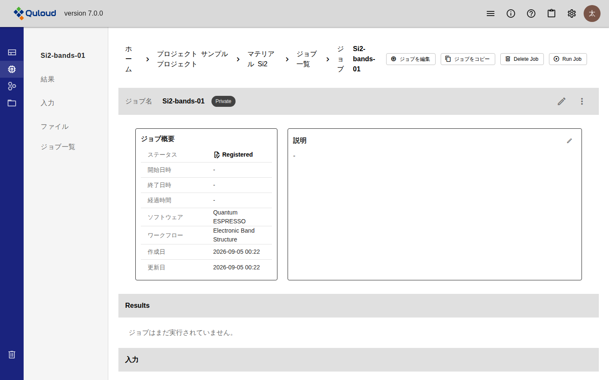
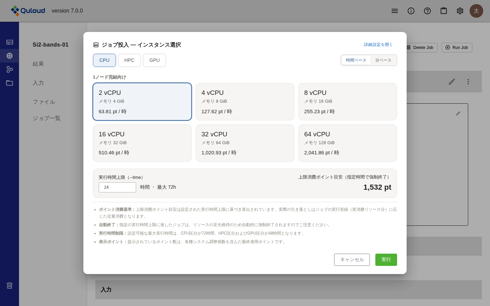
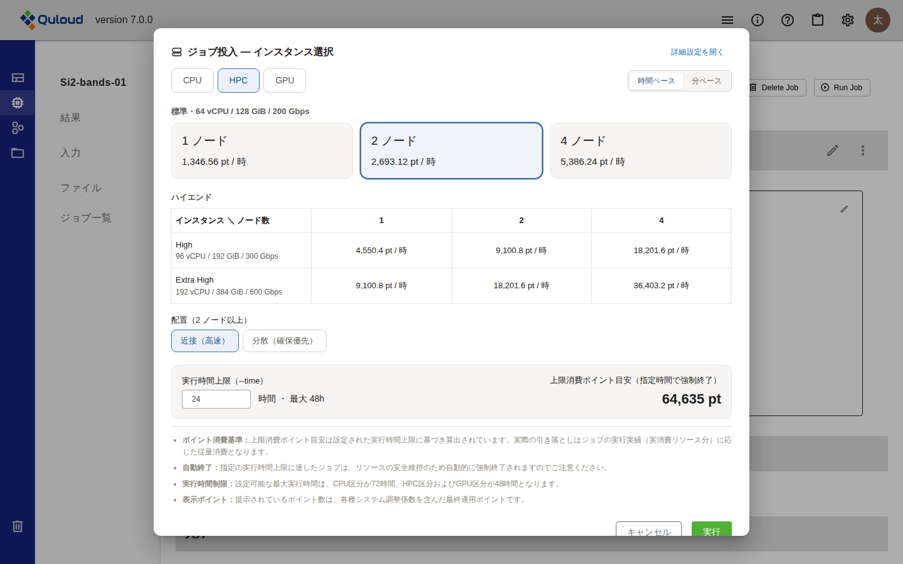
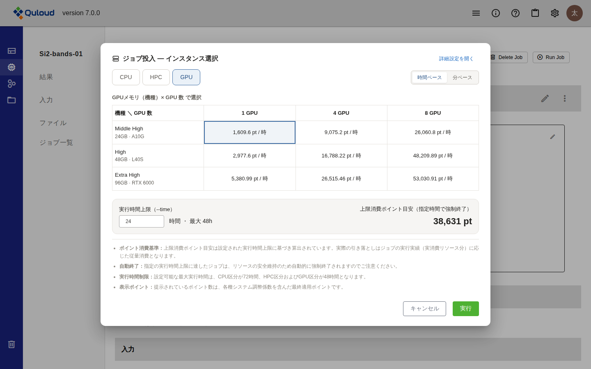
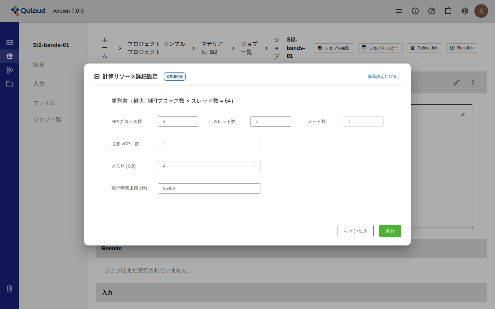
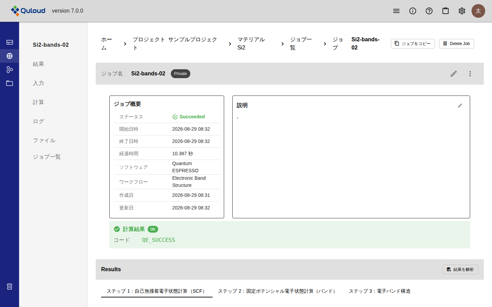
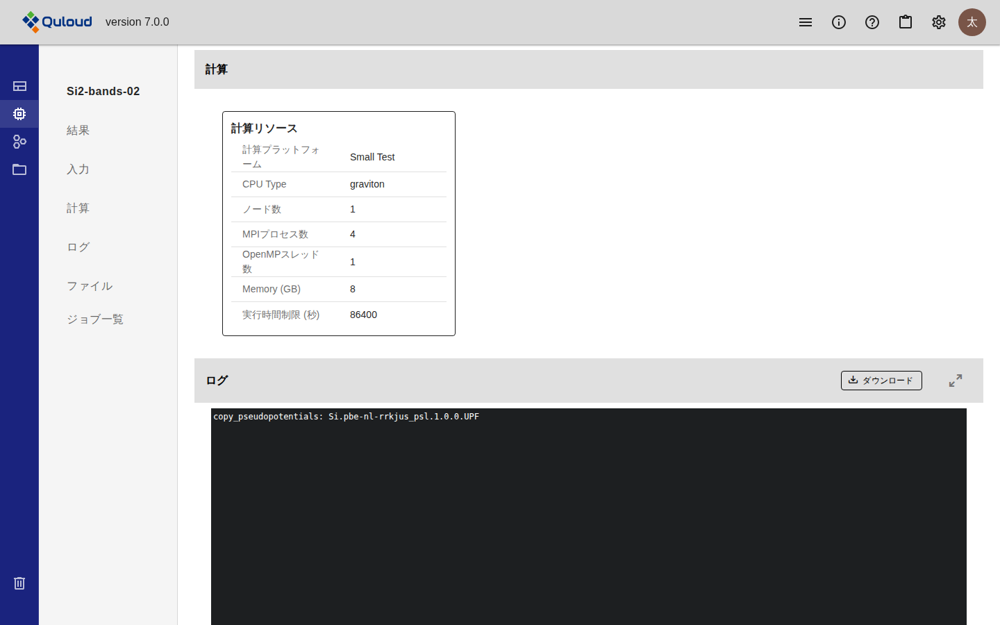

.. _runjob-section:

==============================
計算 Job の実行
==============================

.. note::

   本章は Quloud Ver.7.0 を対象としています。記載内容の確認日は 2026 年 9 月 8 日です。

|
|

------------------------------
概要
------------------------------

登録した計算 Job を実行します。手順は 2 段階です。

1.  「Run Job」で計算リソース（CPU / HPC / GPU）と実行時間の上限を選ぶ
2.  「実行」で Job を投入する

実行するとポイントを消費します。消費量の見積もりは投入前のダイアログに表示されます。

.. note::

   Ver.6.1.2 では、MPI 数・スレッド数・ノード数・計算時間の上限を数値で入力する
   フォームでした。Ver.7.0 では、あらかじめ用意された構成をカードや表から選ぶ方式に
   変わり、選んだ構成の 1 時間あたりのポイント単価と、指定した実行時間での上限消費
   ポイントがその場で表示されます。従来どおり数値で指定したい場合は
   「詳細設定を開く」から入力できます。

|
|

------------------------------
前提
------------------------------

-   実行する Job が登録されていること（:doc:`calculation` の章）。Status が
    「Registered」の Job だけが実行できます
-   テナントが利用制限中でないこと。ポイント残高がない、ストレージの上限を超えている、
    契約期間外のいずれかに当てはまると、画面上部に「このテナントは利用制限中です」と
    表示され、Job を実行できません
-   実行に必要なポイントが残っていること（この章の「ポイントの消費」節）

|
|

------------------------------
操作手順
------------------------------

|

##############################################
1. 実行する Job を開く
##############################################

Material 詳細画面の左のメニューで「ジョブ」を選び、一覧から Job 名を押します。

Status が「Registered」の Job では、画面右上に「Run Job」が表示されます。

   Status が Registered の Job 詳細画面

ジョブ一覧の右端にある「⋮」から「実行」を選んでも、同じダイアログが開きます。

|

##############################################
2. 計算リソースを選ぶ
##############################################

「Run Job」を押すと「ジョブ投入 — インスタンス選択」ダイアログが開きます。
上部の「CPU」「HPC」「GPU」で区分を切り替え、その中から構成を 1 つ選びます。

   「ジョブ投入 — インスタンス選択」ダイアログ（CPU 区分）

各カード・各セルには **1 時間あたりの消費ポイント**\ が表示されます。右上の
「時間ベース」「分ベース」を切り替えると、単価の表示と実行時間上限の単位が
時間と分で入れ替わります。

|

++++++++++++++++++++++++++++++
CPU 区分
++++++++++++++++++++++++++++++

1 ノードで完結する計算に使います。2・4・8・16・32・64 vCPU の 6 種類から選びます。
メモリは vCPU 数に応じて決まり、2 vCPU で 4 GiB、64 vCPU で 128 GiB です。

|

++++++++++++++++++++++++++++++
HPC 区分
++++++++++++++++++++++++++++++

複数ノードを使う計算に使います。「標準」（1 ノードあたり 64 vCPU / 128 GiB /
200 Gbps）を 1・2・4 ノード、または「ハイエンド」の 2 種類を 1・2・4 ノードから
選びます。

選択が表示されている。

   HPC 区分（2 ノードを選んだ状態）

ハイエンドは次の 2 種類です。

.. list-table::
   :header-rows: 1
   :widths: 24 76

   * - 種類
     - 1 ノードあたりの構成
   * - High
     - 96 vCPU / 192 GiB / 300 Gbps
   * - Extra High
     - 192 vCPU / 384 GiB / 600 Gbps

**2 ノード以上を選ぶと「配置」が現れます。** 「近接（高速）」はノードを物理的に
近い位置にまとめて確保するためノード間通信が速くなり、「分散（確保優先）」は
確保しやすさを優先します。

|

++++++++++++++++++++++++++++++
GPU 区分
++++++++++++++++++++++++++++++

GPU を使う計算に使います。機種（GPU メモリ）と GPU 数の組み合わせを表から選びます。

   GPU 区分

.. list-table::
   :header-rows: 1
   :widths: 24 26 50

   * - 機種
     - GPU メモリ
     - 選べる GPU 数
   * - Middle High
     - 24 GB（A10G）
     - 1 / 4 / 8
   * - High
     - 48 GB（L40S）
     - 1 / 4 / 8
   * - Extra High
     - 96 GB（RTX 6000）
     - 1 / 4 / 8

|

##############################################
3. 実行時間の上限を決める
##############################################

ダイアログ下部の「実行時間上限（--time）」に、計算を打ち切るまでの時間を入力します。
上限は区分によって異なります。

.. list-table::
   :header-rows: 1
   :widths: 30 70

   * - 区分
     - 実行時間上限の最大
   * - CPU
     - 72 時間
   * - HPC
     - 48 時間
   * - GPU
     - 48 時間

**上限に達した計算は強制終了されます。** 途中結果は残りますが、計算そのものは
完了しません。右側の「上限消費ポイント目安」は、選んだ構成の単価にこの時間を
掛けた値です。

|

##############################################
4. Job を投入する
##############################################

「実行」を押すと Job が投入されます。「ジョブを投入しました。」と表示され、
Status が「Submitted」に変わります。

ポイントの残高が「上限消費ポイント目安」に満たない場合は投入されず、
「実行に必要なポイントが不足しています。」と表示されます。

|
|

------------------------------
詳細設定
------------------------------

MPI プロセス数・スレッド数・メモリ・実行時間上限（秒）を直接指定する場合は、
ダイアログ右上の「詳細設定を開く」を押します。

   計算リソースの詳細設定

-   直前に選んでいた区分の値が初期値として入ります。区分は右上のバッジで確認できます
-   「必要 vCPU 数」は MPI プロセス数・スレッド数・メモリから自動で決まります。
    直接は入力できません
-   実行時間上限は秒で指定します。最大は 259200 秒（72 時間）です
-   「簡易設定に戻る」を押すと、カードや表から選ぶ画面に戻ります

|
|

------------------------------
結果
------------------------------

投入した Job の Status は、計算の進行に従って次のように変わります。

.. list-table::
   :header-rows: 1
   :widths: 22 78

   * - Status
     - 状態
   * - Registered
     - 登録しただけで、まだ実行していない状態です。この状態の Job だけが実行できます。
   * - Submitted
     - 計算サーバに投入され、実行の順番を待っている状態です。
   * - Prepared
     - まれに現れる状態です。計算サーバのノードに異常が起きたときに設定されます。
   * - Running
     - 計算を実行している状態です。
   * - Succeeded
     - 計算が正常に終了した状態です。
   * - Failed
     - 計算が異常終了した状態です。
   * - Timeout
     - 実行時間の上限に達して打ち切られた状態です。
   * - Cancelled
     - キャンセルされた状態です。

Status と実行の時刻は、Job 詳細画面の「ジョブ概要」で確認できます。

   正常に終了した Job のジョブ概要

「経過時間」は開始日時から終了日時までの秒数です。Job を投入してから終了するまでの
時間には、計算サーバへの受け渡しや結果の取得にかかる時間も含まれるため、
「経過時間」とは一致しません。

実行時に指定した計算リソースは、左のメニューの「計算」から確認できます。

   実行に使った計算リソース

計算結果の見かたは :doc:`visualization` の章で説明します。

.. note::

   **画面は自動では更新されません。** Status の変化を確認するには、画面を
   再読み込みしてください。

|
|

------------------------------
Job のキャンセル
------------------------------

Status が「Submitted」「Prepared」「Running」の Job には、画面右上に
「ジョブをキャンセル」が表示されます。押すと計算サーバ側で計算が打ち切られ、
しばらくすると Status が「Cancelled」に変わります。確認のダイアログは出ません。

ジョブ一覧の「⋮」から「キャンセル」を選んでも同じです。

キャンセルした Job も、実行していた時間の分だけポイントを消費します。

|
|

------------------------------
Job の継続実行
------------------------------

OpenMX の Job に限り、終了した計算の続きから実行し直せます。Status が
「Failed」「Timeout」「Cancelled」の OpenMX の Job には、画面右上に
「Continue Job」が表示されます。

-   押すと「Run Job」と同じダイアログが開き、計算リソースと実行時間の上限を
    選び直せます
-   元の Job の restart データを引き継ぐため、**OpenMX の入力条件は変更できません**
-   継続して実行した Job は別の Job として作られ、Job 詳細画面の「継続履歴」に
    継続元との関係が表示されます

継続できない Job では「Continue Job」は表示されません。

|
|

------------------------------
ポイントの消費
------------------------------

Job の実行ではポイントを消費します。残高はヘッダーの「利用情報」（ⓘ）と、
「利用状況」の画面で確認できます（:doc:`header` の章）。

|

##############################################
投入時に確保される分
##############################################

Job を投入すると、「上限消費ポイント目安」の分がいったん確保されます。確保された
分は、その Job が終わるまで他の Job には使えません。

**実行できるかどうかの判定も、この上限の見積もりで行われます。** 残高から実行中の
Job の確保分を引いた値が上限の見積もりに満たない場合、Job は投入できません。

|

##############################################
終了時に確定する分
##############################################

計算が終わると、実際に実行した時間に応じた分だけが引き落とされます。上限より早く
終わった場合、確保していた差分は残高に戻ります。

-   実行時間が 60 秒に満たない場合は、60 秒として計算されます
-   ディスクの使用に対してもポイントを消費します

|
|

------------------------------
注意事項
------------------------------

-   **実行時間の上限に達した計算は強制終了されます。** 大きな系を計算する場合は、
    上限を余裕のある値にしてください。
-   **投入した Job は編集できません。** 「ジョブを編集」は Status が「Registered」の
    Job にだけ表示されます。実行し直したい場合は「ジョブをコピー」で複製し、
    複製した Job の入力を変更してください。
-   **実行中の Job は削除できません。** 「Delete Job」は Status が「Submitted」
    「Prepared」「Running」の間は表示されません。終了した Job は削除できます。
-   テナントで無効になっている計算ソフトの Job は実行できません。「Run Job」は
    押せない状態になり、「利用中のソフトウェアが無効化されています」と表示されます。
-   計算ソフトごとの制限や既知の問題は :doc:`specifications` の章にまとめています。
