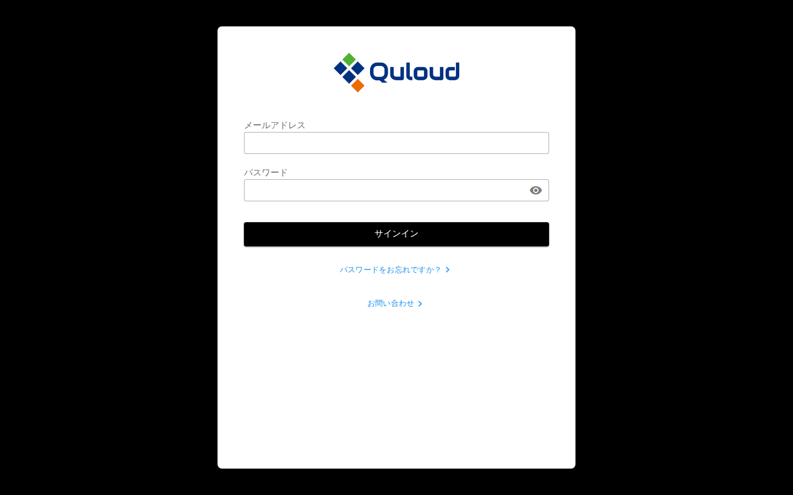
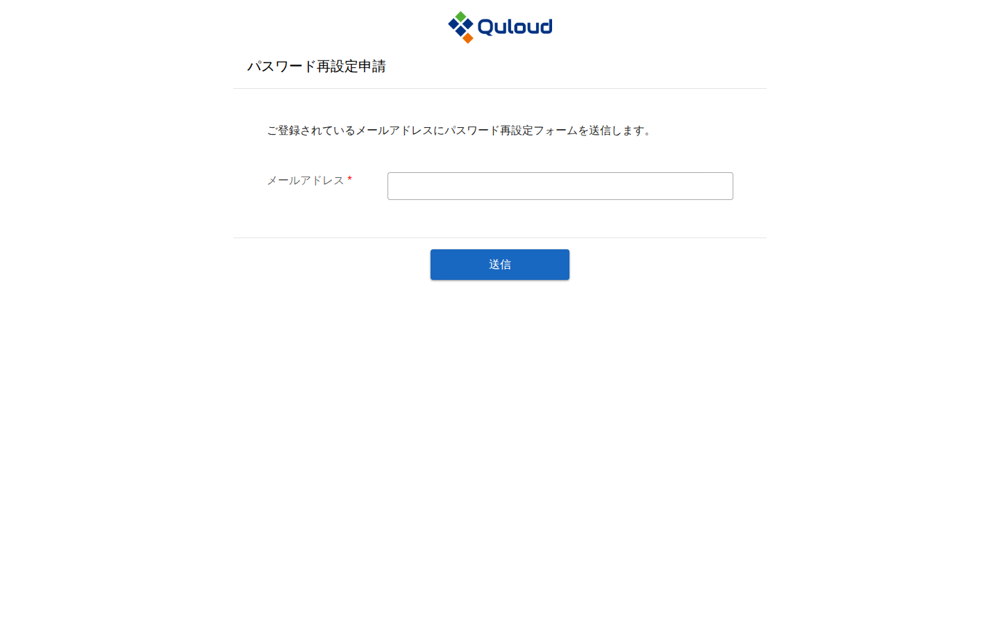
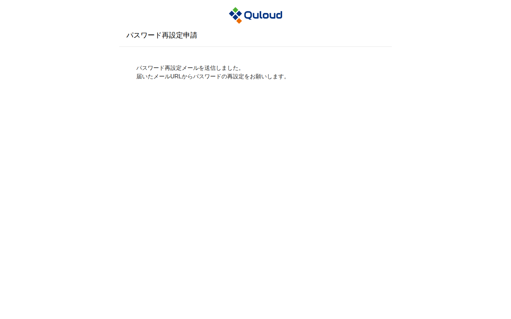
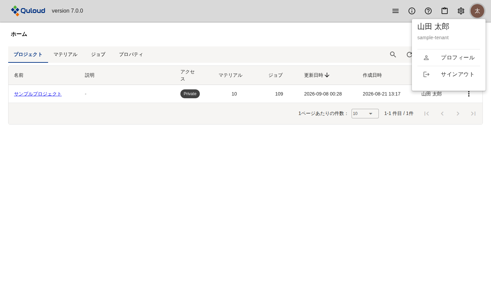

========================================
サインイン・サインアウト
========================================

.. note::

   本章は Quloud Ver.7.0 を対象としています。記載内容の確認日は 2026 年 9 月 8 日です。

サインインするには、以下の URL にアクセスしてください。

https://2g.quloud-platform.com/sign_in

次のサインイン画面が表示されます。

   サインイン画面

|
|

------------------------------
サインイン
------------------------------

登録したメールアドレスと設定したパスワードを入力し、「サインイン」ボタンを押します。
パスワード入力欄の右端にある目のアイコンを押すと、入力したパスワードを表示して確認できます。

サインインすると、ホーム画面に移ります。

.. figure:: images/v70/signin_dashboard_after_signin.png
   :alt: サインイン直後のホーム画面。プロジェクト、マテリアル、ジョブ、プロパティの 4 つのタブがあり、プロジェクトタブが選択されてプロジェクトの一覧が表示されている。

   サインイン直後のホーム画面

ホーム画面の詳細は :doc:`dashboard` の章をご参照ください。

|
|

------------------------------
パスワードを忘れたときは
------------------------------

サインイン画面下部の「パスワードをお忘れですか？」を押すと、**別のタブ**\ でパスワード
再設定申請画面が開きます。

   パスワード再設定申請画面

登録済みのメールアドレスを入力して「送信」ボタンを押すと、そのアドレスにパスワード
再設定用のメールが送信されます。

   申請の送信後の画面

届いたメールに記載された URL を開き、新しいパスワードを設定してください。

|
|

------------------------------
お問い合わせ
------------------------------

サインイン画面下部の「お問い合わせ」を押すと、**別のタブで弊社ウェブサイトの
お問い合わせページ**\ が開きます。サインインしなくても利用できます。

サインイン後は、アプリケーション内のお問い合わせフォームを使えます。カテゴリを選んで
タイトルと内容を記入し、確認画面を経て送信する形式で、サインイン画面からのものとは
別のものです。手順は :doc:`header` の章をご参照ください。

|
|

------------------------------
サインアウト
------------------------------

ヘッダー右端のアカウントのアイコンを押すとメニューが開きます。「サインアウト」を
押してください。

   アカウントメニュー

このメニューには、サインインしているユーザーの氏名と所属テナント名も表示されます。
「プロフィール」からは氏名・役職・表示言語などを確認・変更できます
（:doc:`header` の章を参照）。
