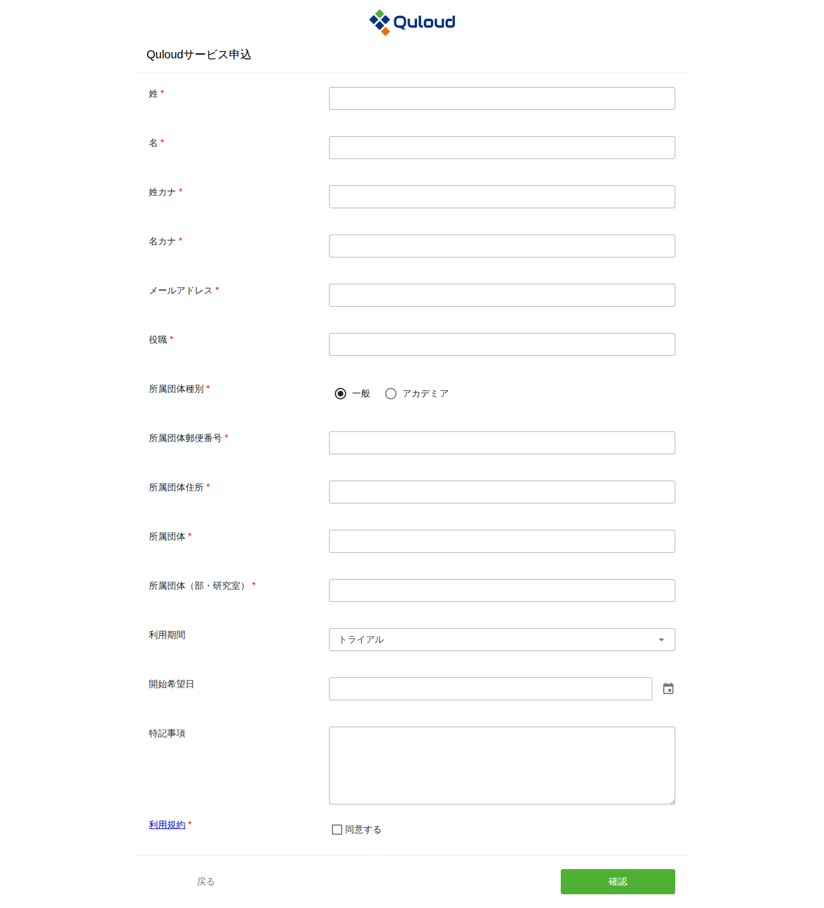
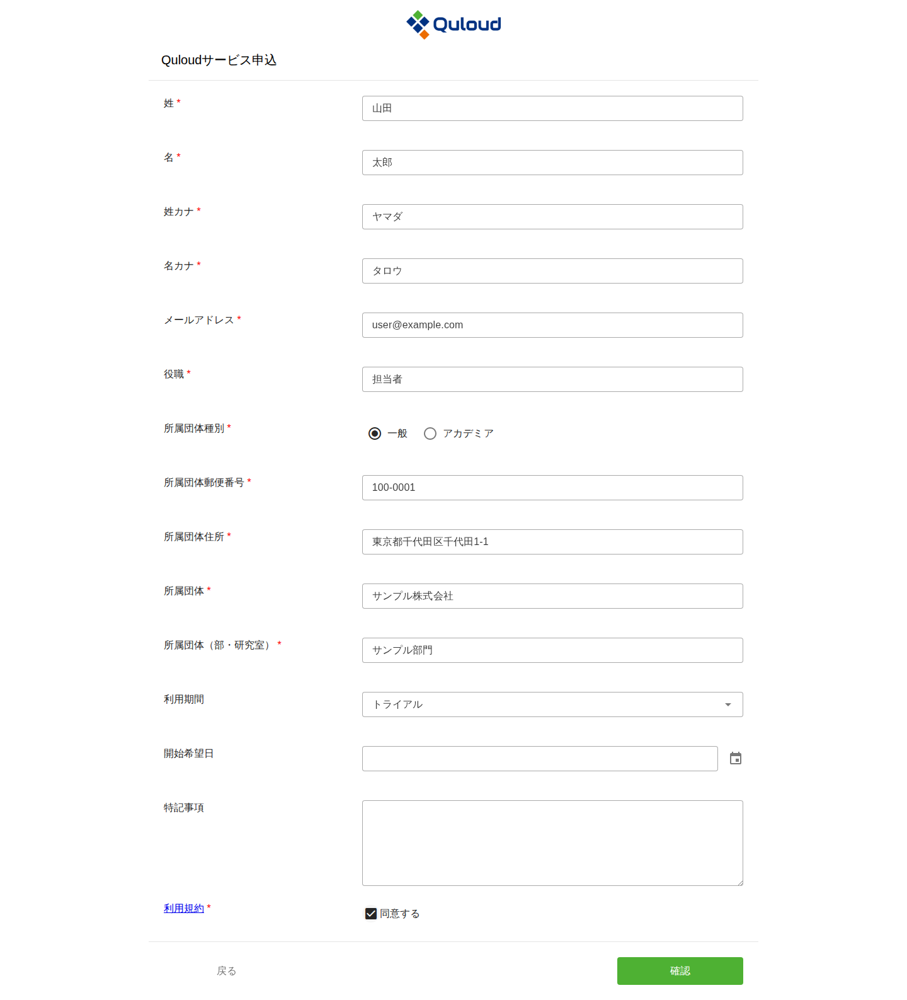
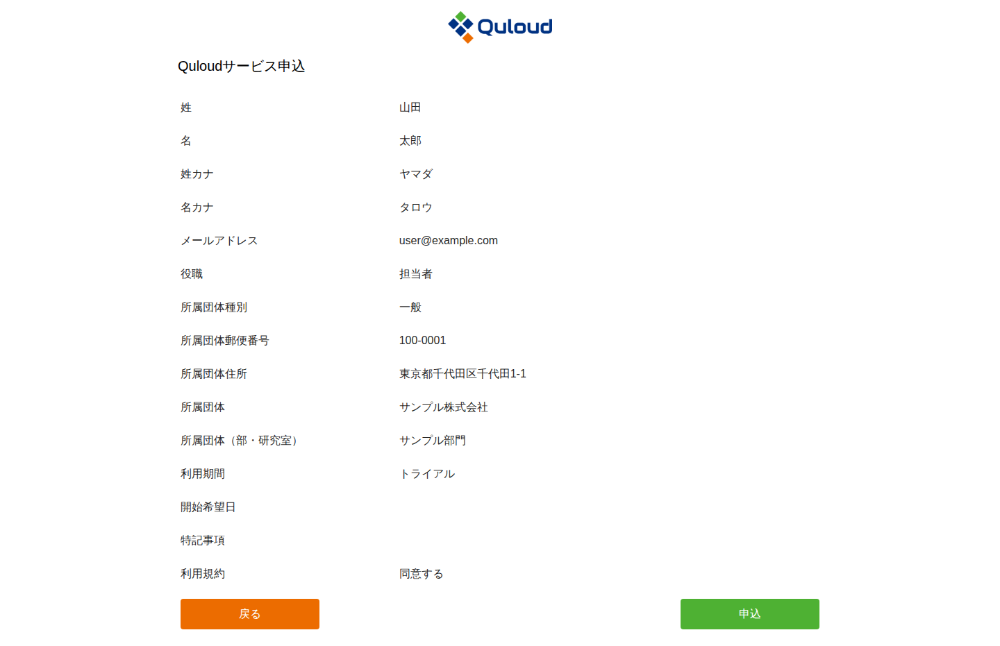
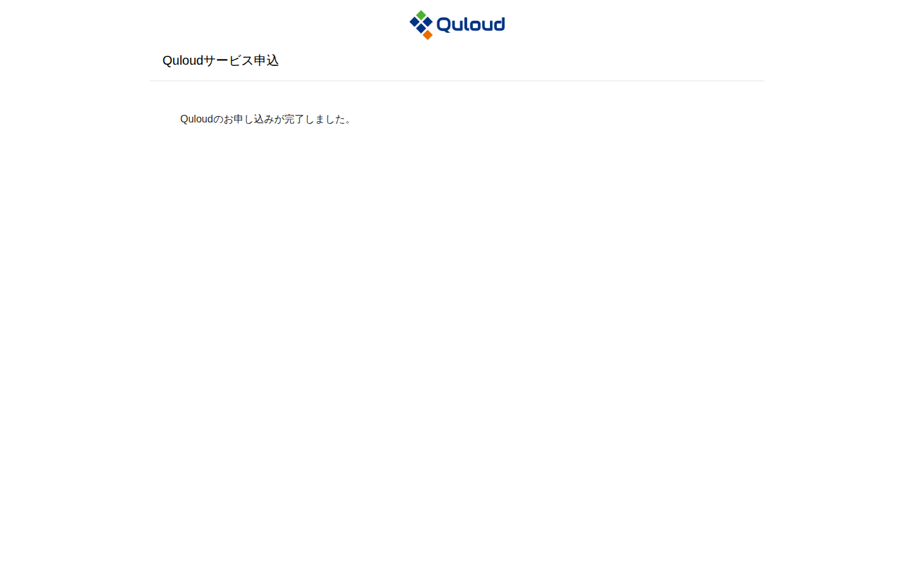

========================================
サインアップ
========================================

.. note::

   本章は Quloud Ver.7.0 を対象としています。記載内容の確認日は 2026 年 9 月 8 日です。

Quloud の利用を開始するには、まず利用申込を行います。以下の URL にアクセスしてください。

https://2g.quloud-platform.com/applicant

|
|

----------------------------------------
利用申込
----------------------------------------

次の申込フォームが表示されます。

   利用申込フォーム

項目名の右に赤い ``*`` が付いている項目は必須です。

-   「姓カナ」「名カナ」はカタカナまたは英字で入力します。
-   「所属団体種別」は「一般」と「アカデミア」から選びます。
-   「利用期間」は「12ヶ月」「6ヶ月」「3ヶ月」「トライアル」から選びます。初期値は
    「トライアル」です。
-   「開始希望日」はカレンダーから選びます。
-   「利用規約」のリンクから利用規約をご確認のうえ、「同意する」にチェックを入れてください。

   入力を終えた利用申込フォーム

|
|

----------------------------------------
入力内容の確認と申込
----------------------------------------

「確認」ボタンを押すと、入力内容の確認画面に移ります。

   入力内容の確認画面

内容を確認し、「申込」ボタンを押すと申込が完了します。修正する場合は「戻る」ボタンで
入力画面に戻ります。

   申込の完了画面

|
|

.. note::

   すでに Quloud を利用しているテナントに参加する場合は、この申込ではなく、
   そのテナントの管理ユーザーから招待を受けます。手順は :doc:`invitation` の章を
   ご参照ください。
