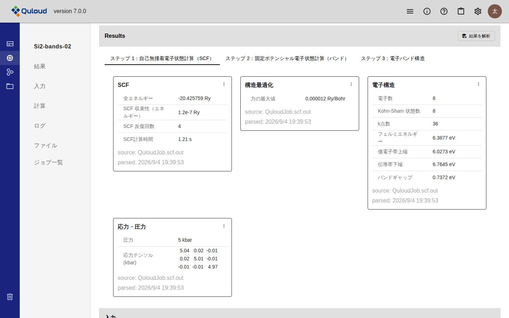
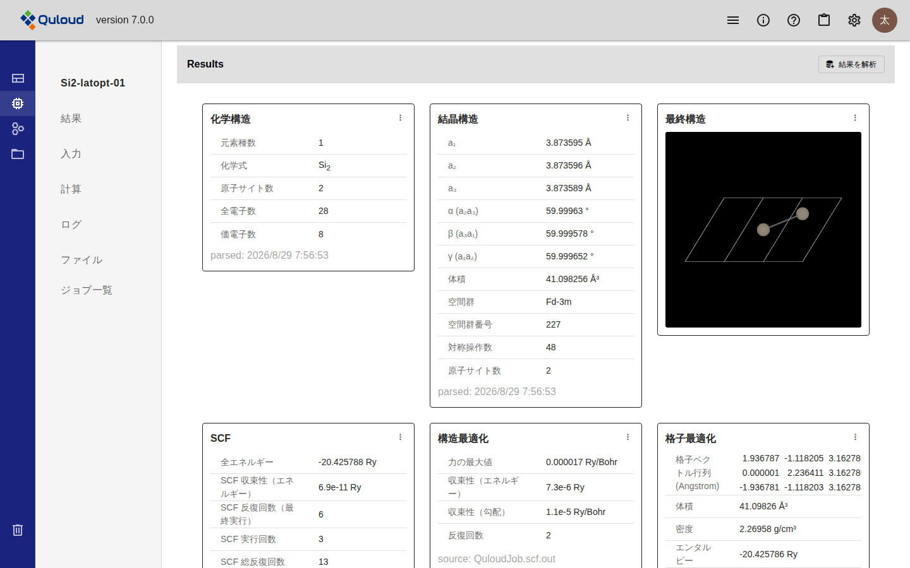
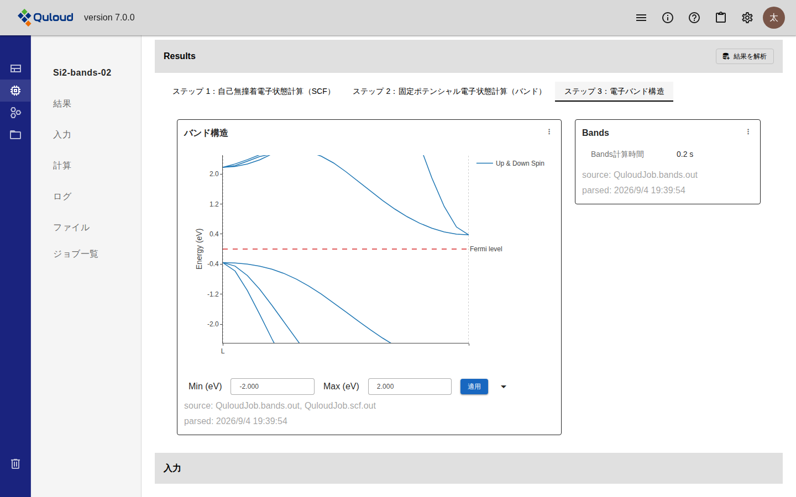
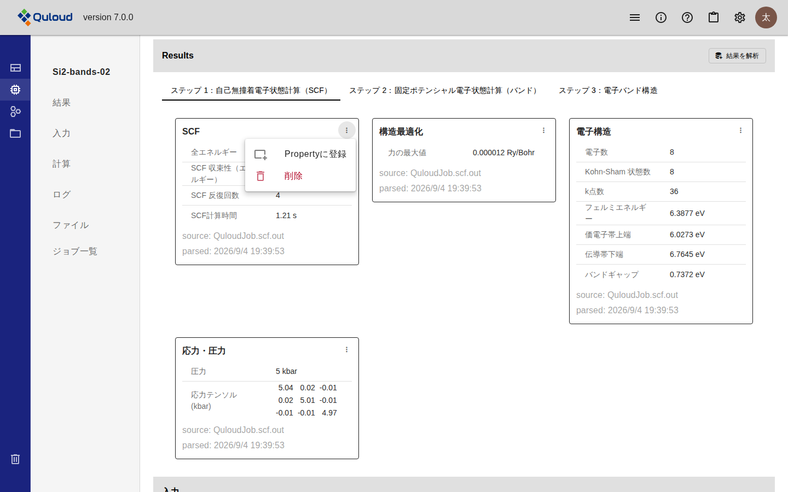

=============================================
計算結果の可視化
=============================================

.. note::

   本章は Quloud Ver.7.0 を対象としています。記載内容の確認日は 2026 年 9 月 8 日です。

|
|

------------------------------
概要
------------------------------

計算が正常に終わると、出力ファイルから値や図が取り出され、Job 詳細画面の
「Results」にカードとして並びます。1 枚のカードが 1 つのまとまり
（SCF、電子構造、バンド構造など）に対応します。

カードは自動では作られません。**「結果を解析」を押した時点で作られます。**

.. note::

   Ver.6.1.2 では、計算結果は Material 詳細画面の「Select Property」から
   Property を選んで見る形でした。Ver.7.0 では、結果はまず Job 詳細画面の
   「Results」に現れ、そこから必要なものを Property として登録します
   （:doc:`property` の章）。

|
|

------------------------------
前提
------------------------------

-   Job の Status が「Succeeded」であること（:doc:`runjob` の章）。
    それ以外の Status では「Results」に理由が表示され、カードは作られません

.. list-table::
   :header-rows: 1
   :widths: 30 70

   * - Status
     - 「Results」の表示
   * - Registered
     - ジョブはまだ実行されていません。
   * - Submitted / Prepared / Running
     - ジョブを実行中です。完了後に「結果を解析」を実行してください。
   * - Cancelled
     - ジョブはキャンセルされました。
   * - Failed
     - ジョブが失敗しました。

|
|

------------------------------
操作手順
------------------------------

|

##############################################
1. 「結果を解析」を押す
##############################################

Job 詳細画面の左のメニューで「結果」を選ぶと「Results」に移動します。
右上の「結果を解析」を押すと、出力ファイルの解析が始まります。

解析がまだのときは「「結果を解析」を実行してください。」と表示されます。

**何度押してもカードは増えません。** 同じまとまりのカードは作り直されます。
削除したカードも、押し直すと元に戻ります。

|

##############################################
2. ステップを切り替える
##############################################

複数ステップの計算機能では、ステップごとにタブが分かれます。
結果はそのステップで実行された計算のものだけが表示されます。

   「Results」（ステップ 1）

入力項目が無いステップと同じように、**結果が無いステップもあります。**
その場合は「このステップの結果はありません」と表示されます。

|

##############################################
3. カードを読む
##############################################

各カードの下部には、どのファイルから取り出したか（``source``）と、
いつ解析したか（``parsed``）が表示されます。値が計算し直されたかどうかは
``parsed`` の日時で判断できます。

|
|

------------------------------
結果カードの種類
------------------------------

|

##############################################
数値の一覧
##############################################

出力ファイルから取り出した数値を表で並べたカードです。上の図の
「SCF」「電子構造」「応力・圧力」がこれにあたります。

どの計算機能でどの数値が取り出されるかは、この章の「計算機能ごとに取り出される数値」に
一覧があります。

|

##############################################
構造
##############################################

構造が変わる計算（構造最適化・格子定数最適化）では、最終構造のカードが加わります。

   構造のカード（格子定数最適化）

-   **化学構造** — 元素種数、化学式、原子サイト数、全電子数、価電子数
-   **結晶構造** — 格子定数、角度、体積、空間群、対称操作数
-   **最終構造** — 計算後の構造を 3D で表示します

これらは計算機能から自動的に作られるもので、後述の「計算機能ごとに取り出される数値」の
表には含まれません。

|

##############################################
図・グラフ
##############################################

計算機能によっては、数値の表ではなく図が表示されます。

   バンド図（電子バンド構造）

バンド図と状態密度の図には、表示するエネルギー範囲を変える「Min (eV)」「Max (eV)」と
「適用」があります。

図が表示される計算機能は次のとおりです。

.. list-table::
   :header-rows: 1
   :widths: 30 22 48

   * - 計算機能
     - 計算ソフト
     - 表示されるもの
   * - 電子バンド構造
     - すべて
     - バンド図
   * - 状態密度計算（DOS）
     - すべて
     - 状態密度曲線
   * - 投影状態密度（PDOS）
     - Quantum ESPRESSO
     - 軌道ごとの部分状態密度曲線
   * - フォノンバンド分散（matdyn）
     - Quantum ESPRESSO
     - フォノンバンド図
   * - フォノン状態密度（matdyn）
     - Quantum ESPRESSO
     - フォノン状態密度曲線
   * - X線吸収スペクトル（XSpectra）
     - Quantum ESPRESSO
     - 吸収スペクトル
   * - NEB（Nudged Elastic Band）
     - すべて
     - 原子構造トラジェクトリ（ビューア）
   * - 古典分子動力学 / 機械学習ポテンシャル MD / 分子動力学
     - すべて
     - 時間発展データ（グラフ）と原子構造トラジェクトリ（ビューア）
   * - 高分子平衡化MD
     - RadonPy
     - 密度の時間発展とトラジェクトリ
   * - DFT-1/2 擬ポテンシャル生成（UPF）
     - DFT-1/2
     - 擬ポテンシャルの補正量のグラフ
   * - 分子振動解析
     - Psi4
     - 熱力学量と振動モードの一覧
   * - 自己無撞着電子状態計算（SCF）
     - Psi4
     - 軌道エネルギー、HOMO-LUMO ギャップ、双極子モーメント

|
|

------------------------------
カードからできること
------------------------------

各カードの右上にある「⋮」からメニューが開きます。

   結果カードのメニュー

.. list-table::
   :header-rows: 1
   :widths: 28 72

   * - 項目
     - 動作
   * - Propertyに登録
     - このカードを Property として登録します。Material 単位で結果を並べて
       比べられるようになります（:doc:`property` の章）。
   * - Materialとして保存
     - 最終構造のカードにだけ表示されます。計算後の構造を新しい Material として
       登録し、続きの計算に使えるようにします。
   * - 削除
     - このカードを消します。確認のダイアログが出ます。出力ファイルは消えません。
       「結果を解析」を押し直せば元に戻ります。

|
|

------------------------------
注意事項
------------------------------

-   **カードが 1 枚も出ないことがあります。** 計算は正常に終わっていても、
    結果を取り出す定義がその計算機能に無い場合や、対象の出力ファイルがその Job に
    無い場合です。「結果を解析」を押したときに理由が表示されます。
-   Ver.6.1.2 以前に作成した Job は、Ver.7.0 で作成した Job と表示内容が異なります
    （:doc:`specifications` の章）。
-   出力ファイルそのものは、左のメニューの「ファイル」からダウンロードできます
    （:doc:`files` の章）。

|
|

------------------------------
計算機能ごとに取り出される数値
------------------------------

以下は、**数値の一覧のカードに表示される項目**\ を計算ソフト・計算機能ごとにまとめた
ものです。見出しの単位（「SCF」「電子構造」など）がカード 1 枚に対応します。

図・グラフのカードと構造のカードは、この表には含まれません。前の節をご覧ください。

列の意味は次のとおりです。

.. list-table::
   :header-rows: 1
   :widths: 20 80

   * - 列
     - 意味
   * - 項目名
     - カードに表示される項目名です。
   * - キー
     - 内部で使われる識別子です。
   * - 型
     - 値の種類です。
   * - 単位
     - 値の単位です。単位が無い項目は ``-`` です。

.. include:: _generated/results_all.rst
